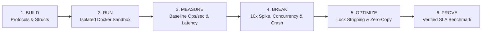
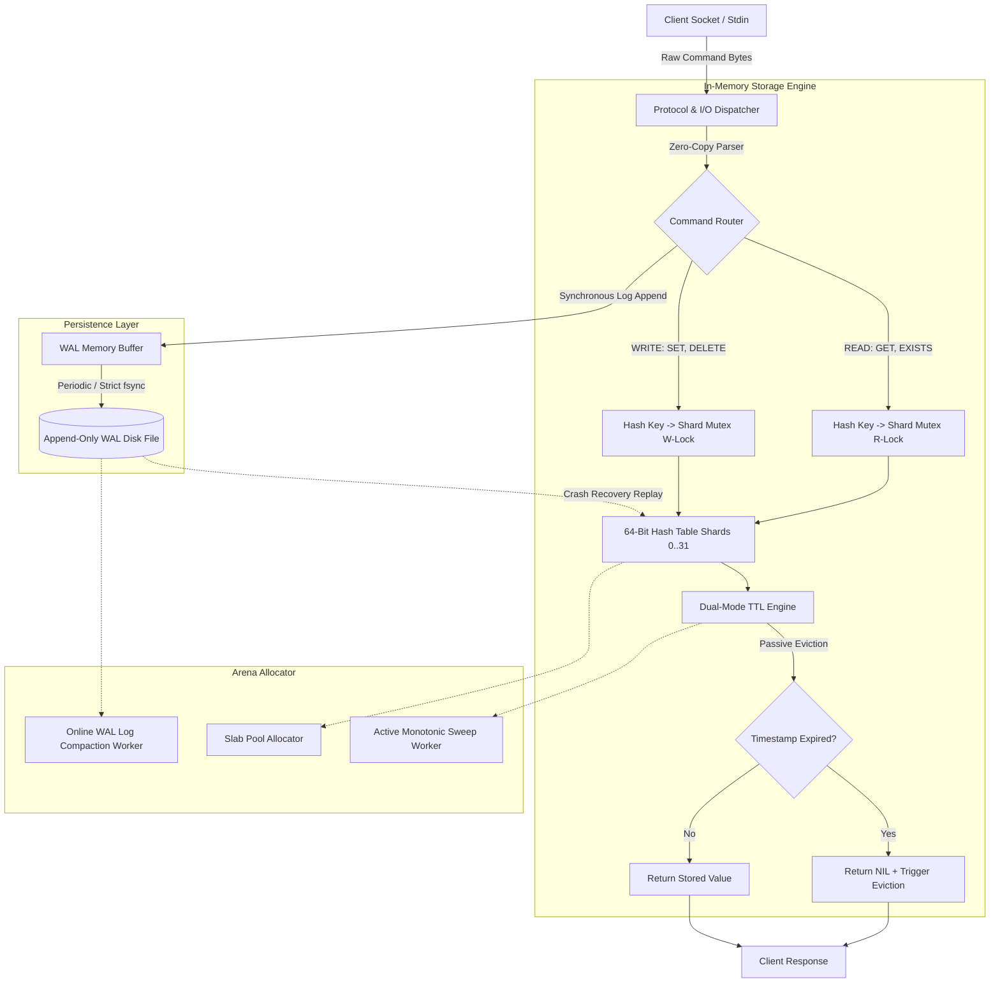
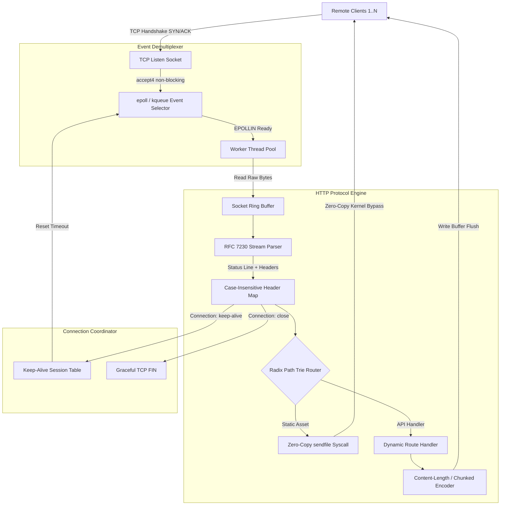
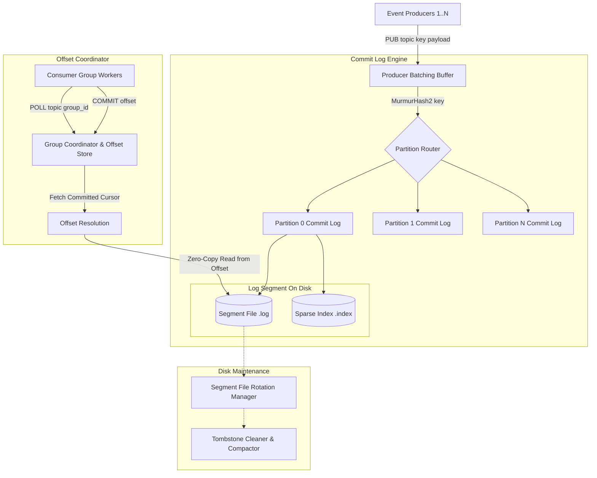
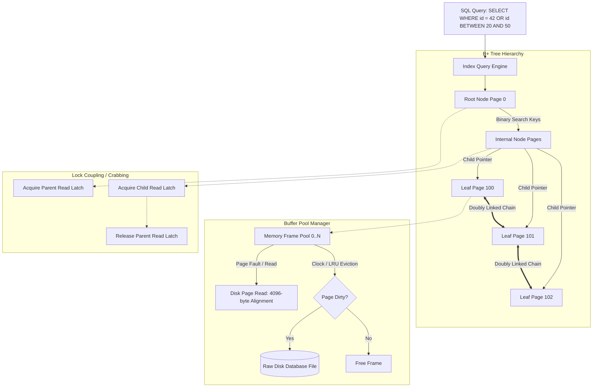
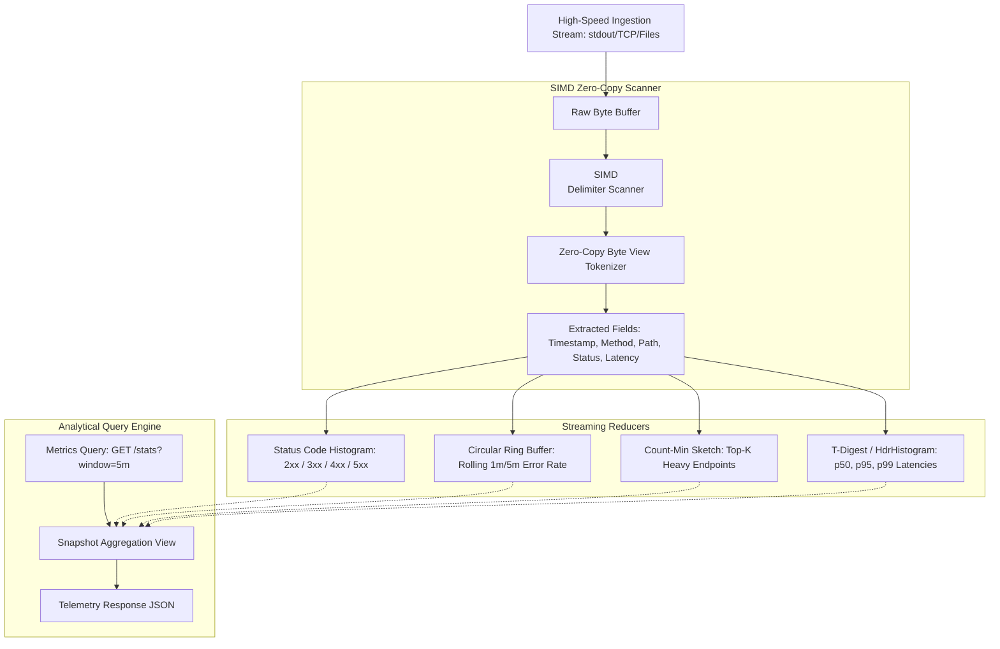
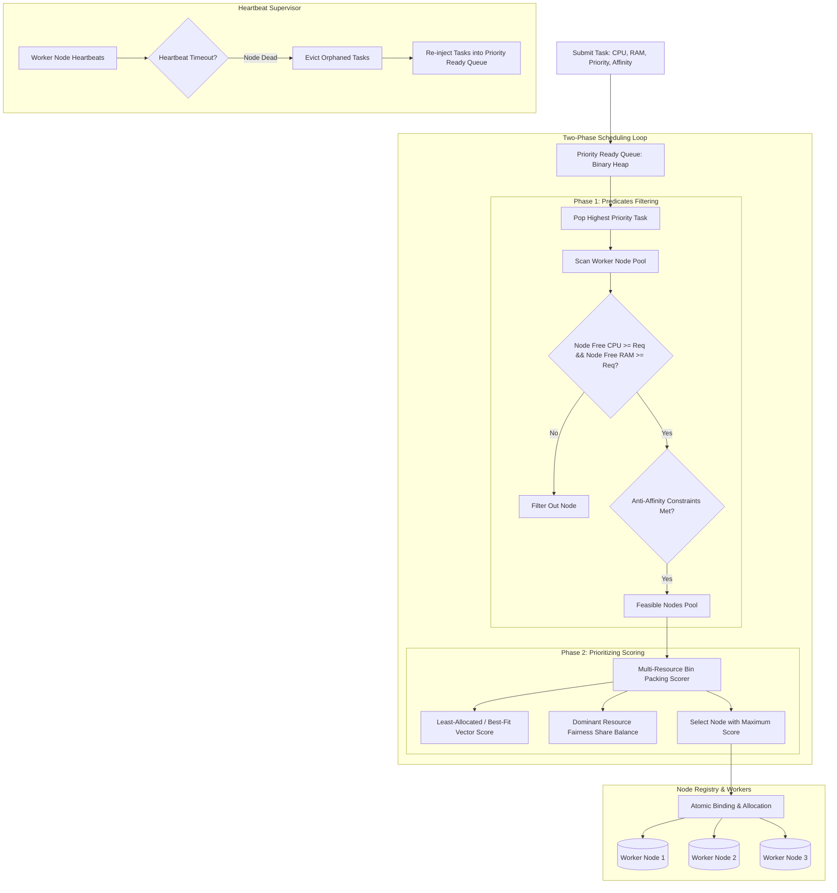
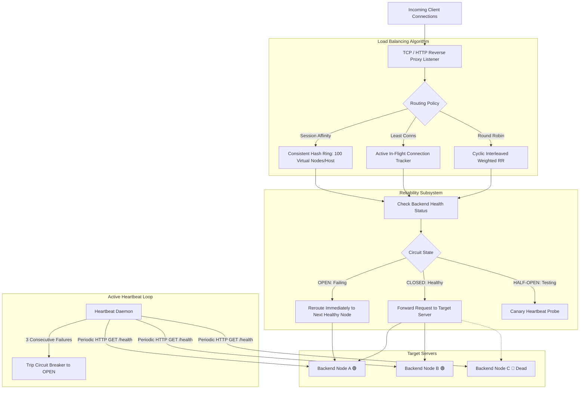
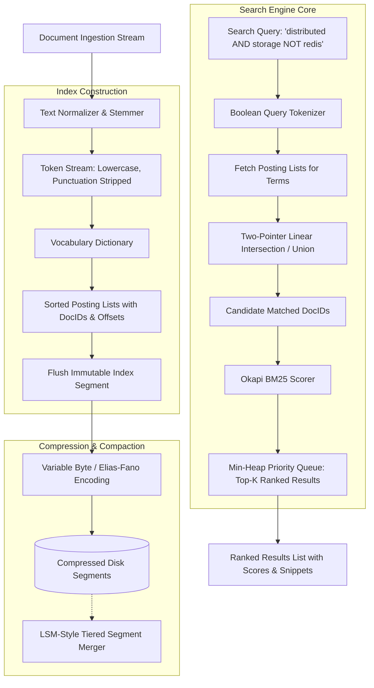

# ALGO Systems Engineering Curriculum: Architecture & Dataflow Blueprints

> **The Definitive Systems Architecture Reference**  
> Complete technical specification, Mermaid dataflow diagrams, ASCII terminal topologies, 6-level progression roadmaps, and target benchmark SLAs for all 10 core engineering challenges.

---

## Table of Contents

1. [Architectural Overview & Engineering Philosophy](#1-architectural-overview--engineering-philosophy)
2. [Master Curriculum Matrix](#2-master-curriculum-matrix)
3. [Challenge 01: Key-Value Storage Engine (Redis-like)](#challenge-01-key-value-storage-engine)
4. [Challenge 02: High-Concurrency HTTP/1.1 Server (Nginx-like)](#challenge-02-high-concurrency-http11-server)
5. [Challenge 03: Distributed Commit Log & Message Queue (Kafka-like)](#challenge-03-distributed-commit-log--message-queue)
6. [Challenge 04: B+ Tree Database Indexing Engine (PostgreSQL-like)](#challenge-04-b-tree-database-indexing-engine)
7. [Challenge 05: Concurrent LRU/LFU Cache (Memcached-like)](#challenge-05-concurrent-lrulfu-cache)
8. [Challenge 06: High-Throughput Log Aggregation Engine (ClickHouse/Loki-like)](#challenge-06-high-throughput-log-aggregation-engine)
9. [Challenge 07: Multi-Resource Task Scheduler (Kubernetes-like)](#challenge-07-multi-resource-task-scheduler)
10. [Challenge 08: Distributed Rate Limiter & Traffic Shaper (Cloudflare/Envoy-like)](#challenge-08-distributed-rate-limiter--traffic-shaper)
11. [Challenge 09: Layer 7 Dynamic Load Balancer (HAProxy-like)](#challenge-09-layer-7-dynamic-load-balancer)
12. [Challenge 10: Inverted-Index Full-Text Search Engine (Lucene/Elasticsearch-like)](#challenge-10-inverted-index-full-text-search-engine)
13. [Comparative Architecture Matrix](#13-comparative-architecture-matrix)

---

## 1. Architectural Overview & Engineering Philosophy

Modern technical assessment has historically relied on leetcode-style algorithmic puzzles tested against static arrays. **ALGO** replaces synthetic puzzle solving with **reconstructive systems engineering**. Engineers implement real infrastructure components from scratch in **C++, Rust, Go, Python, or Java**, subjected to continuous load testing, lock contention, memory pressure, and abrupt process termination (`SIGKILL`) inside hardened Linux containers.

### The 6-Stage Execution Loop



---

## 2. Master Curriculum Matrix

| # | Challenge Name | Domain | Archetype | Signature Question | Difficulty | Target SLA Benchmark |
|---|----------------|--------|-----------|-------------------|------------|----------------------|
| **01** | [Key-Value Storage Engine](#challenge-01-key-value-storage-engine) | `SYSTEMS` | Redis | *Can you make your storage engine faster?* | **Hard** | `> 100,000 ops/s`, `p99 < 0.20ms`, 256MB RAM cap |
| **02** | [High-Concurrency HTTP Server](#challenge-02-high-concurrency-http11-server) | `SYSTEMS` | Nginx | *How many concurrent requests can your server handle?* | **Medium** | `> 50,000 req/s`, C10K concurrency, zero leaks |
| **03** | [Distributed Message Queue](#challenge-03-distributed-commit-log--message-queue) | `SYSTEMS` | Kafka | *Can you increase throughput without losing messages?* | **Hard** | `> 100,000 msg/s`, zero loss on `SIGKILL`, at-least-once |
| **04** | [B+ Tree Database Index](#challenge-04-b-tree-database-indexing-engine) | `SYSTEMS` | PostgreSQL | *Why doesn't a database scan every row?* | **Hard** | `p99 < 0.05ms` on 10M rows, 4KB slotted pages |
| **05** | [Concurrent Cache](#challenge-05-concurrent-lrulfu-cache) | `PERFORMANCE` | Memcached | *Can you increase hit rate without increasing memory?* | **Medium** | `> 1,000,000 req/s`, sub-0.01ms O(1), dynamic ARC |
| **06** | [High-Throughput Log Engine](#challenge-06-high-throughput-log-aggregation-engine) | `PERFORMANCE` | ClickHouse | *Can your system process the stream faster than it arrives?* | **Hard** | `> 200,000 lines/s`, bounded RAM, SIMD tokenization |
| **07** | [Multi-Resource Task Scheduler](#challenge-07-multi-resource-task-scheduler) | `DISTRIBUTED` | Kubernetes | *Can you schedule more work with the same resources?* | **Hard** | `0% deadline miss`, Dominant Resource Fairness (DRF) |
| **08** | [Distributed Rate Limiter](#challenge-08-distributed-rate-limiter--traffic-shaper) | `DISTRIBUTED` | Cloudflare | *Can you enforce the limit without becoming the bottleneck?* | **Medium** | `> 100,000 checks/s`, `p99 < 0.05ms`, atomic CAS |
| **09** | [Layer 7 Load Balancer](#challenge-09-layer-7-dynamic-load-balancer) | `DISTRIBUTED` | HAProxy | *Can your load balancer survive a failing server?* | **Hard** | `< 100ms failover`, zero 5xx, consistent hash ring |
| **10** | [Inverted Search Engine](#challenge-10-inverted-index-full-text-search-engine) | `SEARCH_DATA` | Lucene | *Can you search millions of documents quickly?* | **Hard** | `p99 < 5ms` on 1M docs, BM25 scoring, postings compression |

---

## Challenge 01: Key-Value Storage Engine

- **Archetype**: Redis / RocksDB / Bitcask
- **Domain**: `SYSTEMS` (Storage, Data Structures, Concurrency, Durability)
- **Signature Question**: *Can you make your storage engine faster?*
- **Target SLA**: `> 100,000 ops/s`, `p99 < 0.20ms`, 256MB Hard RAM Boundary, Zero Data Loss on Crash

### Architectural Dataflow Diagram



### ASCII Topology Blueprint

```text
                    KEY-VALUE ENGINE
                           │
        ┌──────────────────┴──────────────────┐
        │                                     │
     Commands                              Storage
        │                                     │
 SET / GET / DELETE / EXISTS             Hash Table
        │                                     │
        └──────────────┬──────────────────────┘
                       │
                 In-Memory Store
                       │
                 ┌─────┴─────┐
                 │           │
              Key         Value
            "score"       "42"
```

### Execution Flow Paths

1. **Write Path (`SET key val [EX seconds]`)**:
   - Stream raw command tokens from socket buffer without heap reallocation.
   - Calculate key hash using 64-bit MurmurHash3. Map hash to one of 32 lock shards (`shard_id = hash % 32`).
   - Acquire exclusive write lock on the target shard mutex.
   - Format WAL binary log frame `[CRC32][OpCode][KeyLength][ValueLength][Key][Value][Expiry]`.
   - Append to WAL buffer and issue `fsync()` (strict) or batch commit (performance mode).
   - Insert/update entry into collision chain; update millisecond expiry timestamp if specified.
   - Release shard mutex and output `+OK\r\n`.

2. **Read Path (`GET key`)**:
   - Parse key, calculate 64-bit hash, acquire shared read lock on shard.
   - Traverse hash bucket collision chain in $O(1)$ average time.
   - If found, verify current monotonic timestamp against expiry:
     - If expired: upgrade to write lock, unlink entry, reclaim memory, return `$-1\r\n`.
     - If valid: return `$length\r\nvalue\r\n`.
   - Release read lock.

3. **Background Maintenance Loops**:
   - **Active TTL Sweeper**: Periodic tick (every 100ms) samples 20 random keys with expiry; deletes expired keys. If $>25\%$ are expired, re-runs immediately.
   - **Online WAL Compactor**: Merges redundant mutations into a clean checkpoint snapshot file when log reaches 2x table size.

### 6-Level Progression Roadmap

1. **Level 1: Protocol & I/O Dispatcher** — O(1) in-memory SET/GET/DELETE/EXISTS protocol tokenizer and reply formatter.
2. **Level 2: Collision-Resistant Hash Table** — 64-bit MurmurHash3, dynamic 0.75 rehashing, separate chaining bucket arrays.
3. **Level 3: Write-Ahead Log & Persistence** — Append-only WAL, synchronous fsync, CRC checksum verification, and crash recovery replay.
4. **Level 4: Dual-Mode TTL Eviction** — Millisecond-precision passive lazy eviction on GET + active monotonic timer sweep cycles.
5. **Level 5: Striped-Mutex Concurrency** — 32-shard mutexes eliminating global lock bottleneck, atomic multi-key operations.
6. **Level 6: Memory Arena & Compaction** — Slab allocation pools, 64-byte cache line alignment, and online background WAL compaction.

---

## Challenge 02: High-Concurrency HTTP/1.1 Server

- **Archetype**: Nginx / Envoy / Node.js llhttp
- **Domain**: `SYSTEMS` (Networking, Non-blocking I/O, Concurrency, Zero-Copy)
- **Signature Question**: *How many concurrent requests can your server handle?*
- **Target SLA**: `> 50,000 req/s`, `p99 < 1.0ms`, C10K Concurrency (10,000 persistent sockets)

### Architectural Dataflow Diagram



### ASCII Topology Blueprint

```text
                  RAW TCP BYTE STREAM
                           │
             ┌─────────────┴─────────────┐
             │                           │
          Framing                     Routing
             │                           │
   RFC 7230 Tokenizer             Radix Path Trie
             │                           │
             └─────────────┬─────────────┘
                           │
                 Socket Connection Pool
                           │
                 ┌─────────┴─────────┐
                 │                   │
               Client             Response
           "GET /users/42"      "200 OK\r\n"
```

### Execution Flow Paths

1. **Ingress & Handshake**:
   - Main reactor thread accepts socket with `SOCK_NONBLOCK | SOCK_CLOEXEC`.
   - Register client file descriptor with kernel event selector (`epoll` edge-triggered or `kqueue`).
2. **Protocol Parsing**:
   - Zero-copy scan through incoming chunk for `\r\n`. Extract HTTP verb (`GET`, `POST`, etc.) and raw URI.
   - Walk Radix Path Trie with dynamic parameter capture (`/api/v1/users/:id`).
   - Parse headers into fixed-capacity hash table without heap reallocations.
3. **Keep-Alive & Egress**:
   - Verify `Content-Length` framing or parse chunked transfer encoding (`hex_size\r\ndata\r\n`).
   - If static file requested: invoke `sendfile()` allowing kernel to transfer disk blocks directly to NIC buffer.
   - Maintain persistent socket connection until idle timeout (default: 5.0s) triggers cleanup.

### 6-Level Progression Roadmap

1. **Level 1: HTTP Protocol Parsing** — Raw socket reads, status line tokenization, zero-copy method/URI parsing, standard 200/404 replies.
2. **Level 2: Dynamic Routing Engine** — Radix trie path matching, dynamic `:param` capture, wildcard suffix dispatching in $O(L)$ time.
3. **Level 3: Header Subsystem & MIME Negotiation** — Case-insensitive lookup, `Content-Type`, `Accept`, date header injection.
4. **Level 4: Body Framing & Chunked Transfer** — Content-Length byte streaming vs chunked transfer decoding, large payload streaming.
5. **Level 5: Keep-Alive & Connection Reuse** — Persistent TCP sessions, idle sweep timers, pipelined request handling.
6. **Level 6: Concurrent Non-Blocking I/O** — Edge-triggered `epoll`/`kqueue`, worker pool isolation, C10K load handling.

---

## Challenge 03: Distributed Commit Log & Message Queue

- **Archetype**: Apache Kafka / RabbitMQ / Redpanda
- **Domain**: `SYSTEMS` (Streaming, Storage, Durability, Partitioning)
- **Signature Question**: *Can you increase throughput without losing messages?*
- **Target SLA**: `> 100,000 msgs/s`, Zero Message Loss on `SIGKILL`, Sequential 64-bit Offset Invariance

### Architectural Dataflow Diagram



### ASCII Topology Blueprint

```text
                     TOPIC LOG ENGINE
                            │
         ┌──────────────────┴──────────────────┐
         │                                     │
     Producers                             Consumers
         │                                     │
   PUB <topic> <msg>                    POLL <topic> [offset]
         │                                     │
         └───────────────┬─────────────────────┘
                         │
                 Segmented Commit Log
                         │
            ┌────────────┼────────────┐
            │            │            │
         [Msg 0]      [Msg 1]      [Msg 2]
         Offset 0     Offset 1     Offset 2
```

### Execution Flow Paths

1. **Publish Path (`PUB <topic> <key> <message>`)**:
   - Compute partition index: `partition = MurmurHash2(key) % partition_count`.
   - Acquire partition append lock; assign monotonically increasing 64-bit offset.
   - Encode binary entry: `[MagicByte][CRC32][Offset:8B][Timestamp:8B][KeyLen:4B][Key][ValLen:4B][Val]`.
   - Append to active `.log` segment file. If current offset matches index interval (every 4KB), record entry in sparse `.index` file `[Offset:4B][BytePosition:4B]`.
2. **Consume Path (`POLL <topic> <consumer_group>`)**:
   - Consumer group coordinator locks partition assignments using consistent hashing.
   - Resolve consumer's last committed offset from `__consumer_offsets` table.
   - Binary search the sparse `.index` file to locate closest physical byte offset $\le$ target offset.
   - Seek to byte position in `.log` file and stream sequential message records directly to socket.
3. **Durability & Crash Recovery**:
   - On sudden power cut (`SIGKILL`), upon reboot the engine scans last segment from last verified index point, validates CRC32 checksums, truncates partial writes, and restores offset watermark.

### 6-Level Progression Roadmap

1. **Level 1: In-Memory FIFO Queue** — Fast in-memory circular ring buffer, PUB/POLL primitives, topic isolation.
2. **Level 2: Sequential 64-Bit Offset Assignor** — Monotonic immutable commit log offsets, replayable history, non-destructive consumption.
3. **Level 3: Key-Based Partition Hash Router** — MurmurHash2 key sharding, guaranteeing strict per-key ordering across parallel partitions.
4. **Level 4: Consumer Group Offset Coordinator** — Dynamic partition assignment, heartbeat timers, consumer commits, at-least-once delivery.
5. **Level 5: High-Throughput Batching Engine** — Configurable buffer batching (`linger_ms` / `max_batch_bytes`), amortized disk syscalls.
6. **Level 6: Append-Only Segmented Log Recovery** — Rolling 1GB segment rotation, binary sparse index, CRC validation, crash recovery replay.

---

## Challenge 04: B+ Tree Database Indexing Engine

- **Archetype**: PostgreSQL / SQLite / InnoDB
- **Domain**: `SYSTEMS` (Storage Engines, Disk Architecture, B+ Trees, Paging)
- **Signature Question**: *Why doesn't a database scan every row?*
- **Target SLA**: `10M Record Search Time < 0.05ms` (vs 500ms table scan), 4KB Sector-Aligned Pages

### Architectural Dataflow Diagram



### ASCII Topology Blueprint

```text
                     B+TREE ROOT NODE
                            │
               ┌────────────┴────────────┐
               │    Keys: [ 20 | 50 ]    │
               │   Child Ptrs: [A, B, C] │
               └────────────┬────────────┘
                            │
        ┌───────────────────┼───────────────────┐
        ▼                   ▼                   ▼
    Leaf Node A         Leaf Node B         Leaf Node C
 [1..19] ──Next──►   [20..49] ──Next──►   [50..99] ──Next──► NULL
```

### Execution Flow Paths

1. **Point Lookup (`FIND key`)**:
   - Begin at Root Page ID (Page 0).
   - Fetch page through Buffer Pool Manager (hits RAM frame or triggers 4KB disk read).
   - Binary search sorted keys inside node. Identify child pointer $C_i$ where $K_{i-1} \le Key < K_i$.
   - Repeat until reaching a Leaf Node (level 0).
   - Binary search leaf tuples for exact key match. Return record RID `[PageId, SlotOffset]`.
2. **Range Scan (`SCAN min_key max_key`)**:
   - Traverse tree to locate Leaf Node containing `min_key`.
   - Read matching keys sequentially within leaf.
   - Follow `next_page_id` pointer directly to sibling leaf node without climbing back up the tree.
   - Continue until key $> \text{max\_key}$.
3. **Node Split on Overflow**:
   - When inserting into a leaf with $N = 2M$ elements: allocate new page ID.
   - Split $2M$ keys into two halves of $M$ keys each.
   - Promote median key to parent node. If parent overflows, propagate splits recursively upward. If root splits, create new root with level $+1$.

### 6-Level Progression Roadmap

1. **Level 1: Linear Scan Baseline** — Full sequential disk scan across 10M records, benchmarking raw $O(N)$ penalty.
2. **Level 2: Sorted Array Binary Search Index** — In-memory sorted array index demonstrating $O(\log N)$ lookup speedup.
3. **Level 3: Self-Balancing B-Tree Node Splitter** — M-way tree invariants, page overflow detection, upward median promotion.
4. **Level 4: B+ Tree Linked Leaf Chain** — Doubly linked leaf nodes, efficient sequential range scans (`BETWEEN min AND max`).
5. **Level 5: 4KB Slotted Page Disk Formatter** — Hardware sector alignment (4096 bytes), slotted page header, slot array pointers.
6. **Level 6: Buffer Pool Manager** — Clock/LRU frame replacement, dirty flag tracking, latch crabbing for concurrent traversal.

---

## Challenge 05: Concurrent LRU/LFU Cache

- **Archetype**: Redis / Memcached / Guava Cache
- **Domain**: `PERFORMANCE` (Eviction Algorithms, Cache Coherence, Memory Budgets)
- **Signature Question**: *Can you increase hit rate without increasing memory?*
- **Target SLA**: `> 1,000,000 req/s`, `p99 < 0.01ms`, Strict Physical Byte Memory Cap, Dynamic ARC Mode

### Architectural Dataflow Diagram

```mermaid
flowchart TD
    Client[Read/Write Client Request] --> Router{Operation: GET or SET?}
    
    subgraph Core Index [O(1) Key Hash Map]
        Router -->|Compute Hash| MapLookup[Hash Table Bucket Resolution]
    end

    subgraph Eviction Mechanics [Recency & Frequency Subsystem]
        MapLookup -->|Cache Hit| HitPath[Promote Node to Head]
        MapLookup -->|Cache Miss| MissPath[Fetch from Origin Backend]
        
        subgraph LRU Mode [Doubly-Linked List]
            HitPath --> Splicer[Unlink Node from Current Pos]
            Splicer --> PrependMRU[Insert at MRU Head]
            EvictTail[Evict LRU Tail Node]
        end

        subgraph LFU Mode [Frequency Bucket Array]
            HitPath --> IncFreq[Increment Node Counter]
            IncFreq --> MoveBucket[Promote to Frequency Bucket N+1]
            EvictMinFreq[Evict Node from Min-Frequency Bucket]
        end
    end

    subgraph Memory Management [Byte-Accurate Limiter]
        MissPath --> SizeCheck{Current RAM + New Size > Max RAM?}
        SizeCheck -->|Yes| EvictTail
        SizeCheck -->|No| Alloc[Allocate Entry]
        Alloc --> PrependMRU
    end

    subgraph TTL Layer [Monotonic Expiry Min-Heap]
        Alloc --> ExpiryHeap[Insert into Min-Heap Expiry Priority Queue]
        ExpiryHeap -.-> Sweeper[Passive GET Validation + Active Clock Sweep]
    end
```

### ASCII Topology Blueprint

```text
                  HASH MAP (O(1) Lookup)
                    "alpha" ──► Node A
                    "beta"  ──► Node B
                             │
              ┌──────────────┴──────────────┐
              ▼                             ▼
        [Head / MRU]                   [Tail / LRU]
       ┌─────────────┐               ┌─────────────┐
       │ Node B: 42  │ ◄───────────► │ Node A: 10  │
       └─────────────┘               └─────────────┘
       (Most Recent)                 (Evict First)
```

### Execution Flow Paths

1. **Cache GET (`GET key`)**:
   - Look up key in pointer hash table.
   - If missing: increment miss counter, return `NIL`.
   - If present: check TTL timestamp. If expired, unlink node, free memory, return `NIL`.
   - **LRU Update**: Unlink node from current position in doubly-linked list; reconnect previous and next pointers; prepend node to list head (MRU).
   - **LFU Update**: Increment node frequency counter; detach from bucket $F$; attach to bucket $F+1$; advance `min_frequency` pointer if needed.
   - Return payload.
2. **Cache SET with Memory Eviction (`SET key val [bytes]`)**:
   - Compute exact payload footprint: `sizeof(Node) + key.length + val.length`.
   - While `current_bytes + new_bytes > max_memory_bytes`:
     - Pop tail node from doubly linked list (LRU) or lowest frequency bucket (LFU).
     - Remove key from hash map; subtract freed bytes from `current_bytes`.
   - Allocate new node, append to list head / frequency bucket 1, add to hash map.

### 6-Level Progression Roadmap

1. **Level 1: Fixed Capacity LRU Cache** — Doubly linked list + hash map, $O(1)$ GET/PUT, tail eviction upon capacity overflow.
2. **Level 2: Access Recency MRU Promotion** — Pointer splicing on read path, zero-allocation list re-linking, latency profiling.
3. **Level 3: LFU Frequency Bucket Chains** — Frequency count tiers, $O(1)$ least-frequently-used eviction, frequency aging to prevent starvation.
4. **Level 4: Millisecond TTL Expiration** — Monotonic clock validation, passive on-read eviction + min-heap active timer sweeps.
5. **Level 5: Byte-Accurate Memory Budgeter** — Physical memory tracking (keys, values, struct overhead), hard byte limits.
6. **Level 6: Hit-Ratio Telemetry & ARC** — Adaptive Replacement Cache (ARC) self-tuning between recency and frequency under bursty access patterns.

---

## Challenge 06: High-Throughput Log Aggregation Engine

- **Archetype**: ClickHouse / Grafana Loki / Vector
- **Domain**: `PERFORMANCE` (Streaming Telemetry, SIMD Parsing, Rolling Windows, Sketching)
- **Signature Question**: *Can your system process the stream faster than it arrives?*
- **Target SLA**: `> 200,000 lines/sec`, Zero Heap Allocation During Stream, SIMD Delimiter Scanning

### Architectural Dataflow Diagram



### ASCII Topology Blueprint

```text
                     LOG STREAM PIPELINE
                             │
            ┌────────────────┴────────────────┐
            │                                 │
     Ingest Stream                     Query Engine
            │                                 │
  Zero-Copy Tokenizer                Metrics & Aggregates
            │                                 │
            └────────────────┬────────────────┘
                             │
                   Streaming Aggregator
                             │
              ┌──────────────┼──────────────┐
              ▼              ▼              ▼
         Histograms      Top-K Heavy    Percentiles
        [2xx/4xx/5xx]    [Endpoints]   [p50/p95/p99]
```

### Execution Flow Paths

1. **Ingestion & Tokenization**:
   - Stream raw byte chunks into a 64KB pinned ring buffer.
   - Use vectorized byte scanning (or single-pass pointer increments) searching for delimiter spaces and newlines.
   - Populate `LogRecordView` containing slice pointers without copying strings.
2. **Concurrent Streaming Reduction**:
   - Increment status family bucket array: `counters[status / 100]++`.
   - Update circular ring buffer slot corresponding to `timestamp_seconds % window_size`.
   - Hash the endpoint path with 4 independent hash functions into Count-Min Sketch matrix `CMS[row][hash_i % width]++`.
   - Insert numerical latency into T-Digest / HdrHistogram quantile estimator.
3. **Query Resolution**:
   - Read current error rate directly from circular buffer sum in $O(1)$ time.
   - Extract top endpoints using min-heap priority queue over top candidate list.
   - Compute exact percentiles from histogram bins in $< 1.0\mu s$.

### 6-Level Progression Roadmap

1. **Level 1: Streaming Log Tokenizer** — Single-pass byte scanning, zero-allocation token extraction from standard streams.
2. **Level 2: Status Family Histograms** — Direct array-indexed counters (2xx, 3xx, 4xx, 5xx), $O(1)$ bucketing under heavy load.
3. **Level 3: Rolling Window Error Rates** — Circular ring buffer time buckets, bounded-memory sliding error rates.
4. **Level 4: Top-K Frequent Endpoint Sketch** — Count-Min Sketch / Space-Saving algorithms for heavy hitter discovery in bounded RAM.
5. **Level 5: Percentile Latency Estimator** — HdrHistogram / T-Digest streaming approximation of p50, p95, and p99 latencies.
6. **Level 6: High-Throughput Burst Pipeline** — Vectorized SIMD parsing, multi-threaded batch reduction, sustaining 200,000+ lines/sec.

---

## Challenge 07: Multi-Resource Task Scheduler

- **Archetype**: Kubernetes `kube-scheduler` / Apache Mesos
- **Domain**: `DISTRIBUTED_SYSTEMS` (Bin Packing, Resource Scheduling, Fairness, High Availability)
- **Signature Question**: *Can you schedule more work with the same resources?*
- **Target SLA**: `0% Deadline Miss`, Dominant Resource Fairness (DRF), Sub-1ms Scheduling Latency

### Architectural Dataflow Diagram



### ASCII Topology Blueprint

```text
                     TASK SCHEDULER
                            │
         ┌──────────────────┴──────────────────┐
         │                                     │
     Job Queue                             Cluster
         │                                     │
  SUBMIT task cpu=2 ram=2048              Worker Nodes
         │                                     │
         └───────────────┬─────────────────────┘
                         │
                 Scheduling Filter
                         │
            ┌────────────┼────────────┐
            ▼            ▼            ▼
       [Node 1]      [Node 2]      [Node 3]
       4C / 8192M    8C / 16384M   16C / 32768M
```

### Execution Flow Paths

1. **Submission & Queueing**:
   - Parse task specifications: CPU cores, RAM MB, priority class, affinity tags.
   - Enqueue into binary max-heap ordered by `(priority_tier DESC, submit_time ASC)`.
2. **Filtering (Predicates)**:
   - Filter candidate worker nodes: evaluate available allocatable CPU and RAM.
   - Eliminate nodes violating hard anti-affinity constraints (e.g., co-locating two identical database primaries).
3. **Scoring (Priorities)**:
   - Calculate multidimensional Euclidean distance for bin-packing: $\sqrt{(\Delta \text{CPU})^2 + (\Delta \text{RAM})^2}$.
   - Apply Dominant Resource Fairness (DRF): identify dominant share $s_i = \max(\frac{c_i}{C}, \frac{r_i}{R})$ and prioritize tenant with minimum dominant share.
4. **Binding & Fault Resilience**:
   - Atomically deduct allocated resources from selected node.
   - Maintain heartbeat timer. If node misses 3 consecutive heartbeats, declare dead, reclaim cluster resource counters, and re-enqueue tasks with elevated priority.

### 6-Level Progression Roadmap

1. **Level 1: Node Registry & FIFO Scheduling Filter** — Multi-resource capacity checks, first-fit node placement.
2. **Level 2: Priority-Based Ready Queue** — Priority classes (Critical, High, Batch), anti-starvation mechanisms.
3. **Level 3: Multi-Resource Bin Packing** — Best-fit vector heuristics minimizing stranded CPU and RAM fragments.
4. **Level 4: Task Lifecycle & Resource Deallocation** — State transitions (`PENDING` $\to$ `RUNNING` $\to$ `COMPLETED`), clean resource recycling.
5. **Level 5: Node Failure & Dynamic Rescheduling** — Heartbeat leasing, failure detection, automated task evacuation.
6. **Level 6: Dominant Resource Fairness (DRF)** — Max-min fairness multi-tenant allocation across heterogeneous multi-resource clusters.

---

## Challenge 08: Distributed Rate Limiter & Traffic Shaper

- **Archetype**: Cloudflare / Envoy / Stripe API Gateways
- **Domain**: `DISTRIBUTED_SYSTEMS` (Algorithms, Traffic Shaping, Atomic CAS, Concurrency)
- **Signature Question**: *Can you enforce the limit without becoming the bottleneck?*
- **Target SLA**: `> 100,000 checks/sec`, Decision Latency `< 0.05ms`, Atomic Lockless CAS

### Architectural Dataflow Diagram

```mermaid
flowchart TD
    Req[Incoming HTTP Request] --> KeyGen[Extract Client Identity: IP, API Key, Tenant]
    
    subgraph Rate Limiter Engine [Policy & Token Evaluator]
        KeyGen --> AlgRouter{Algorithm Selector}
        
        subgraph Token Bucket Mode [Burst-Tolerant Limiter]
            AlgRouter --> TokenBucket[Token Bucket State: Tokens, LastRefillTime]
            TokenBucket --> CalcRefill[Compute Delta Time: Now - LastRefill]
            CalcRefill --> AddTokens[Tokens = min(MaxTokens, Tokens + Delta * Rate)]
            AddTokens --> HasToken{Tokens >= 1.0?}
            HasToken -->|Yes| Decrement[Tokens = Tokens - 1.0]
            HasToken -->|No| TokenReject[Bucket Empty]
        end

        subgraph Sliding Window Log Mode [Zero-Spike Limiter]
            AlgRouter --> DequeLog[Timestamp Deque]
            DequeLog --> TrimOld[Evict Timestamps < Now - WindowSize]
            TrimOld --> CountLog{Deque Length < MaxLimit?}
            CountLog -->|Yes| AppendNow[Append Current Timestamp]
            CountLog -->|No| LogReject[Window Saturated]
        end

        subgraph Leaky Bucket Shaper [Smooth Outflow Shaper]
            AlgRouter --> LeakyQueue[Bounded FIFO Queue]
            LeakyQueue --> QueueSpace{Queue Not Full?}
            QueueSpace -->|Yes| EnqueueReq[Buffer Request]
            QueueSpace -->|No| LeakReject[Buffer Overflow]
        end
    end

    Decrement --> Allow[200 OK: Request Allowed]
    AppendNow --> Allow
    EnqueueReq --> SmoothOutput[Constant Rate Outflow Worker]
    
    TokenReject --> Deny[429 Too Many Requests: Retry-After Header]
    LogReject --> Deny
    LeakReject --> Deny
```

### ASCII Topology Blueprint

```text
                  INCOMING HTTP REQUEST
                            │
               ┌────────────┴────────────┐
               │  Identity Key (IP/User) │
               └────────────┬────────────┘
                            │
                     Refill Clock
                            │
                  ┌─────────▼─────────┐
                  │   Token Bucket    │
                  │ [ • • • • • ]     │ Max: Burst
                  └─────────┬─────────┘
                            │
             ┌──────────────┴──────────────┐
             ▼                             ▼
       Tokens Available             Bucket Empty
             │                             │
        200 ALLOW                    429 RATE_LIMITED
```

### Execution Flow Paths

1. **Token Bucket Flow (Lazy Continuous Refill)**:
   - Fetch client bucket state: `{ tokens: float, last_updated: uint64 }`.
   - Calculate elapsed time $\Delta t = \text{now}() - \text{last\_updated}$.
   - Add new tokens: $\text{tokens} = \min(\text{capacity}, \text{tokens} + \Delta t \times \text{refill\_rate})$.
   - If $\text{tokens} \ge 1.0$: decrement $\text{tokens} -= 1.0$; update `last_updated = now()`; return `ALLOWED`.
   - If $\text{tokens} < 1.0$: calculate $\text{retry\_after} = \frac{1.0 - \text{tokens}}{\text{refill\_rate}}$; return `429 TOO MANY REQUESTS`.
2. **Lockless Atomic Implementation**:
   - Pack tokens and timestamp into single 64-bit integer or use `atomic_compare_exchange_weak`.
   - Eliminates thread lock contention under 100,000+ checks/second.

### 6-Level Progression Roadmap

1. **Level 1: Fixed-Window Counter** — Epoch-based time bucketing, monotonic counter increments, demonstrating 2x boundary burst edge cases.
2. **Level 2: Sliding-Window Timestamp Log** — Microsecond timestamp deque, continuous window eviction, boundary spike elimination.
3. **Level 3: Continuous-Refill Token Bucket** — Lazy token refill on arrival, sustained rate enforcement with burst headroom.
4. **Level 4: Leaky Bucket Traffic Shaper** — FIFO queue buffering, constant outbound discharge frequency for downstream protection.
5. **Level 5: Multi-Tenant Tiered Quotas** — Tier resolution (Free, Pro, Enterprise), dynamic capacity limits and burst multipliers.
6. **Level 6: High-Concurrency Lockless State** — Atomic CAS state updates, zero mutex contention, distributed clock skew mitigation.

---

## Challenge 09: Layer 7 Dynamic Load Balancer

- **Archetype**: HAProxy / Nginx / Traefik
- **Domain**: `DISTRIBUTED_SYSTEMS` (Reverse Proxy, Dynamic Routing, Circuit Breaking, Consistent Hashing)
- **Signature Question**: *Can your load balancer survive a failing server?*
- **Target SLA**: `< 100ms Failover Detection`, Zero 5xx Errors During Chaos Injection, Dynamic Weighting

### Architectural Dataflow Diagram



### ASCII Topology Blueprint

```text
                     CLIENT INGRESS
                            │
               ┌────────────┴────────────┐
               │   Smooth Weighted RR    │
               └────────────┬────────────┘
                            │
                   Virtual Hash Ring
                 (100 vnodes per host)
                            │
        ┌───────────────────┼───────────────────┐
        ▼                   ▼                   ▼
    Backend A           Backend B           Backend C
   (Healthy 🟢)        (Healthy 🟢)        (Dead 🔴)
                            │
                            ▼
                    Circuit Breaker
```

### Execution Flow Paths

1. **Weighted Round-Robin (Smooth Interleaved)**:
   - For each candidate server $i$: $\text{current\_weight}_i += \text{effective\_weight}_i$.
   - Select server with maximum $\text{current\_weight}$.
   - Deduct total weight sum: $\text{current\_weight}_{\text{selected}} -= \sum \text{effective\_weight}$.
   - Disperses traffic smoothly without clustering consecutive requests on high-capacity nodes.
2. **Consistent Hash Ring with Virtual Nodes**:
   - Hash each server into 100 virtual nodes across a 32-bit integer ring: `hash(server_id + "#vnode_" + i)`.
   - Hash client IP or Session Cookie onto ring.
   - Binary search ring for first virtual node with $\text{hash} \ge \text{client\_hash}$.
   - When a node fails or scales up, only $\frac{1}{N}$ keys are remapped.
3. **Circuit Breaker & Zero 5xx Failover**:
   - If backend connection fails or returns 5xx: increment failure counter.
   - If consecutive failures $\ge$ threshold (e.g. 3): trip breaker to `OPEN`.
   - Immediately retry failed request on next healthy server in pool within $< 100ms$, preventing 5xx leaks to client.

### 6-Level Progression Roadmap

1. **Level 1: Cyclic Round-Robin Dispatcher** — Sequential rotation, pointer wraparound modulo arithmetic, empty pool handling.
2. **Level 2: Smooth Weighted Round-Robin** — Interleaved current-weight balancing, capacity-proportional traffic distribution.
3. **Level 3: Least-Connections Dynamic Routing** — In-flight active connection counters, real-time load shedding.
4. **Level 4: Active & Passive Health Checking** — Heartbeat probes, consecutive failure trip counter, dead-node circuit breaking.
5. **Level 5: Consistent Hashing Ring** — Ketama 32-bit virtual node ring, session affinity, minimal key remapping.
6. **Level 6: Zero-Downtime Hot Reloading** — Connection draining, graceful backend registration/deregistration without dropping packets.

---

## Challenge 10: Inverted-Index Full-Text Search Engine

- **Archetype**: Apache Lucene / Elasticsearch / Meilisearch
- **Domain**: `SEARCH_DATA` (Information Retrieval, Indexing, BM25, Compression)
- **Signature Question**: *Can you search millions of documents quickly?*
- **Target SLA**: `Query Latency < 5ms over 1,000,000 Docs`, BM25 Relevance, Posting List Compression

### Architectural Dataflow Diagram



### ASCII Topology Blueprint

```text
                     DOCUMENT CORPUS
                            │
               ┌────────────┴────────────┐
               │  Tokenizer & Normalizer │
               └────────────┬────────────┘
                            │
                     Inverted Index
                            │
         Term ────────► Posting List with Doc IDs
        "engine"  ──► [ Doc 1, Doc 4, Doc 9 ]
        "redis"   ──► [ Doc 1, Doc 2 ]
                            │
             ┌──────────────┴──────────────┐
             ▼                             ▼
       Boolean Query                 BM25 Scorer
     (AND / OR / NOT)             (TF-IDF Relevance)
```

### Execution Flow Paths

1. **Document Tokenization & Indexing**:
   - Normalize text: lowercase conversion, Unicode punctuation stripping, optional stemming.
   - For each term: append `(doc_id, term_frequency, [positions])` to postings list.
   - Maintain posting lists sorted strictly by `doc_id`.
2. **Boolean Query Evaluation**:
   - For `TermA AND TermB`: initialize pointers $p_A, p_B$ to start of each posting list.
   - While $p_A \ne \text{end}$ and $p_B \ne \text{end}$:
     - If $\text{docId}(p_A) == \text{docId}(p_B)$: record match, advance both.
     - Else if $\text{docId}(p_A) < \text{docId}(p_B)$: advance $p_A$.
     - Else: advance $p_B$.
   - Runs in $O(|P_A| + |P_B|)$ time without allocating intermediate hash sets.
3. **Okapi BM25 Scoring**:
   $$\text{Score}(D, Q) = \sum_{i=1}^{n} \text{IDF}(q_i) \cdot \frac{f(q_i, D) \cdot (k_1 + 1)}{f(q_i, D) + k_1 \cdot \left(1 - b + b \cdot \frac{|D|}{\text{avgdl}}\right)}$$
   - Computes sub-linear saturation for high term frequencies and penalizes bloated documents using document length normalization.

### 6-Level Progression Roadmap

1. **Level 1: Inverted Index & Text Tokenizer** — Alphanumeric tokenizer, dictionary map, sorted document ID posting lists.
2. **Level 2: Boolean Query Evaluator** — High-speed two-pointer posting list intersection (AND), union (OR), difference (NOT).
3. **Level 3: TF-IDF Vector Space Relevance** — Term frequency (TF) and inverse document frequency (IDF) relevance weights.
4. **Level 4: Okapi BM25 Ranking Engine** — Statistical saturation ($k_1 = 1.2$) and document length normalization ($b = 0.75$).
5. **Level 5: Positional Postings & Phrase Search** — Word offset recording, exact multi-word phrase matching with proximity queries.
6. **Level 6: Posting List Compression & LSM Compaction** — Variable Byte encoding, 80% memory footprint reduction, immutable segment merging.

---

## 13. Comparative Architecture Matrix

| Challenge | Concurrency Model | Primary Storage Medium | Algorithmic Invariants | Key Syscalls / Hardware Interfaces | Bottleneck Squeezed |
|-----------|-------------------|------------------------|------------------------|------------------------------------|---------------------|
| **01. Key-Value Engine** | 32-Shard Striped Mutex | In-Memory + Disk WAL | $O(1)$ Hash Table, Murmur3 | `fsync`, `write`, `read`, RAM cache line | Global lock contention, disk write latency |
| **02. HTTP Server** | Non-blocking Event Loop | TCP Socket Streams | $O(L)$ Radix Path Trie | `epoll_wait`, `accept4`, `sendfile` | C10K socket connection saturation |
| **03. Message Queue** | Single Partition Append Lock | Segmented Disk Log | Sequential Monotonic Offsets | `writev`, `lseek`, Sequential Disk I/O | Random disk seeks, lock serialization |
| **04. Database Index** | Latch Crabbing / Coupling | 4KB Paged Disk Blocks | $O(\log_M N)$ B+ Tree Balance | Direct File I/O, 4096-byte Alignment | $O(N)$ sequential table scans |
| **05. Concurrent Cache** | Fine-Grained Segment Locks | Physical RAM Allocations | $O(1)$ Doubly-Linked Pointer Splicing | Memory arena allocators, Monotonic Clocks | Lock contention, eviction thrashing |
| **06. Log Engine** | Lock-Free Streaming Ring | Pinned RAM Buffers | Streaming Quantiles, Count-Min Sketch | SIMD Vector Instructions, Ring Buffers | Memory allocation churn during high ingest |
| **07. Task Scheduler** | Priority Queue Heap | Memory Registry | Dominant Resource Fairness (DRF) | Clock timers, atomic state transitions | Resource fragmentation, starvation |
| **08. Rate Limiter** | Lockless Atomic CAS | In-Memory / Distributed Map | Continuous Refill Differential | `atomic_compare_exchange`, microsecond clocks | Lock serialisation on hot API keys |
| **09. Load Balancer** | Event-Driven Proxy | Network Sockets | Virtual Node Consistent Hashing | Socket proxying, non-blocking TCP connect | Cascading 5xx backend server failures |
| **10. Search Engine** | Read-Only Concurrent Query | Inverted Index Segments | Two-Pointer Intersection, BM25 | Variable Byte Encoding, File MMap | Inverted index posting list memory bloat |

---

*ALGO Architecture Reference • Verified against production test suites and containerized benchmarks.*
