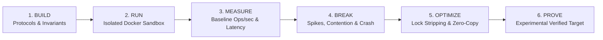
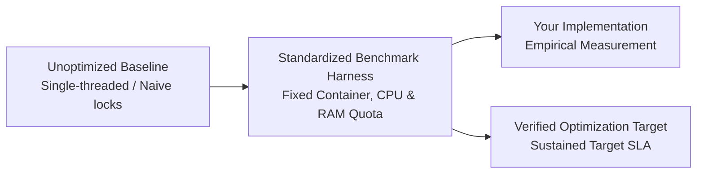
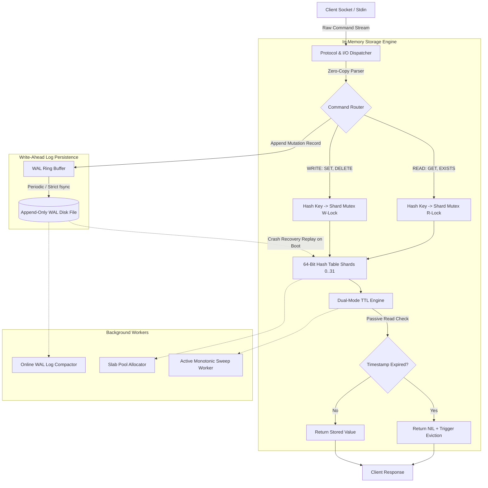
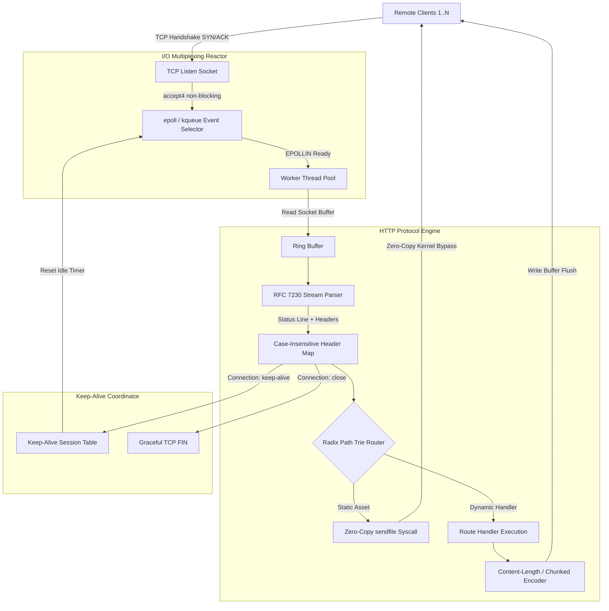
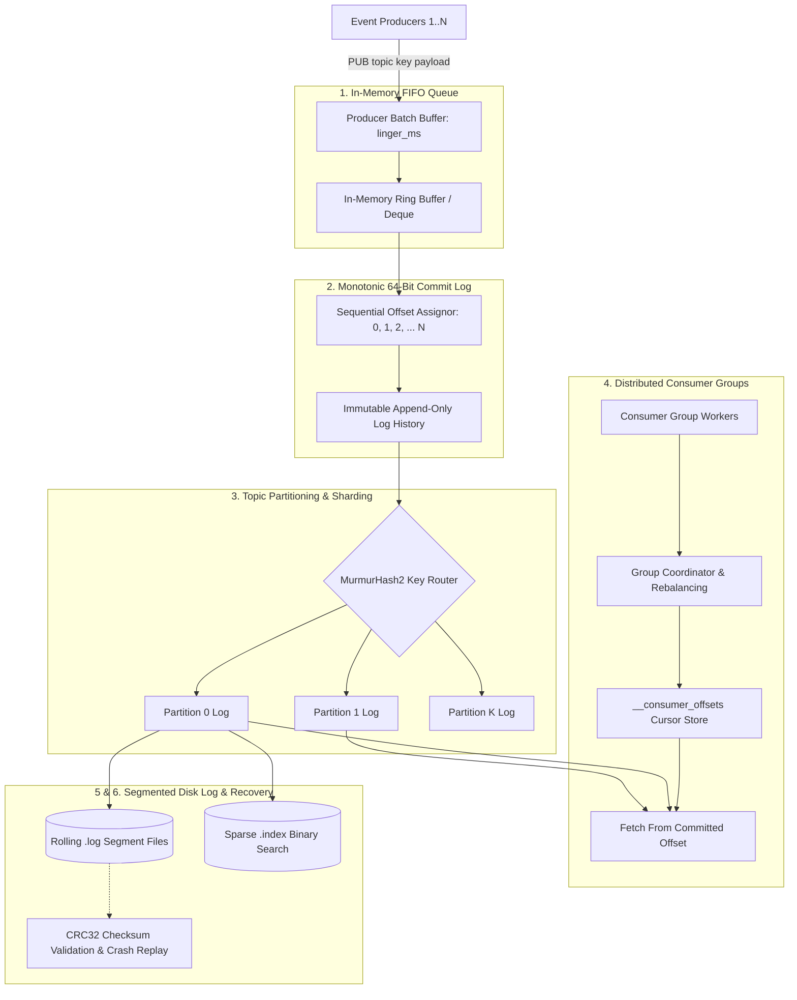
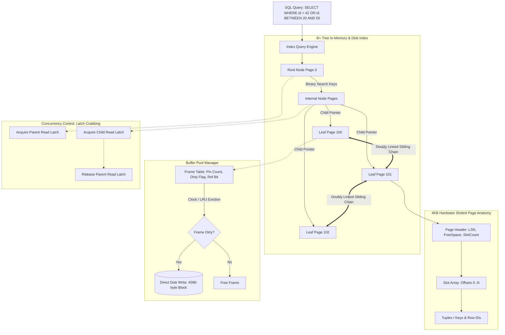
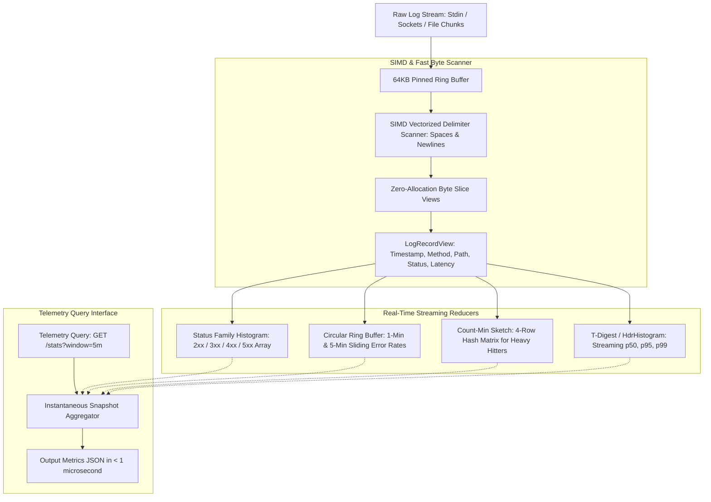
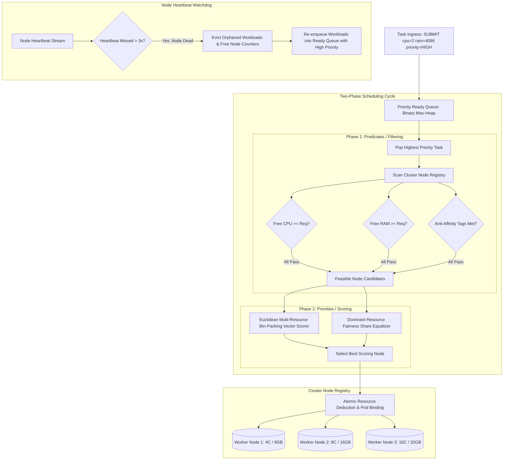
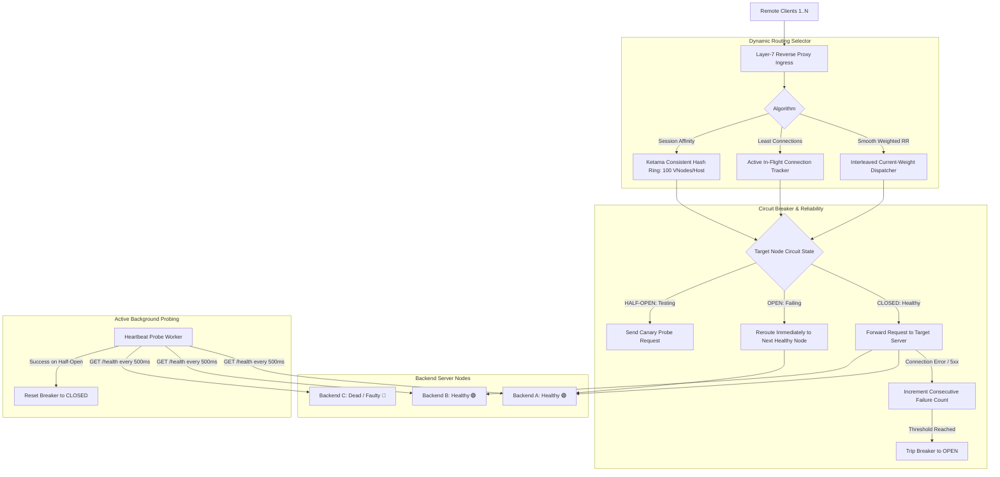

# ALGO Systems Engineering Curriculum: Architecture & Dataflow Blueprints

> **The Definitive Systems Architecture Reference**  
> *"Encounter 10 real engineering problems that force you to understand how modern systems work."*  
> Complete technical specification, refined Mermaid dataflow diagrams, ASCII terminal topologies, 6-level pedagogical roadmaps, and standardized experimental benchmark targets for all 10 core engineering challenges.

---

## Table of Contents

1. [Architectural Overview & Engineering Philosophy](#1-architectural-overview--engineering-philosophy)
2. [Master Curriculum Matrix](#2-master-curriculum-matrix)
3. [Standardized Experimental Benchmark Methodology](#3-standardized-experimental-benchmark-methodology)
4. [Challenge 01: Key-Value Storage Engine](#challenge-01-key-value-storage-engine)
5. [Challenge 02: High-Concurrency HTTP Server](#challenge-02-high-concurrency-http-server)
6. [Challenge 03: Commit Log & Message Queue](#challenge-03-commit-log--message-queue)
7. [Challenge 04: B+ Tree Database Index Engine](#challenge-04-b-tree-database-index-engine)
8. [Challenge 05: Concurrent Cache & Eviction Engine](#challenge-05-concurrent-cache--eviction-engine)
9. [Challenge 06: Streaming Log Analytics Engine](#challenge-06-streaming-log-analytics-engine)
10. [Challenge 07: Multi-Resource Task Scheduler](#challenge-07-multi-resource-task-scheduler)
11. [Challenge 08: Concurrent Rate Limiter & Traffic Shaper](#challenge-08-concurrent-rate-limiter--traffic-shaper)
12. [Challenge 09: Dynamic Layer-7 Load Balancer](#challenge-09-dynamic-layer-7-load-balancer)
13. [Challenge 10: Inverted-Index Search Engine](#challenge-10-inverted-index-search-engine)
14. [Comparative Systems Architecture Matrix](#14-comparative-systems-architecture-matrix)

---

## 1. Architectural Overview & Engineering Philosophy

Modern technical assessment has historically relied on leetcode-style algorithmic puzzles tested against static arrays. **ALGO** replaces synthetic puzzle solving with **reconstructive systems engineering**. Engineers do not build toy clones of famous applications; rather, they **encounter 10 real engineering problems that force them to understand how modern systems work**.

Engineers implement core infrastructure components from scratch in **C++, Rust, Go, Python, or Java**, subjected to continuous load testing, lock contention, memory pressure, and abrupt process termination (`SIGKILL`) inside isolated Linux containers.

### The 6-Stage Systems Execution Loop



---

## 2. Master Curriculum Matrix

| # | Challenge Name | Domain | Real-World References | Signature Engineering Question | Difficulty | Standardized Target Benchmark |
|---|----------------|--------|-----------------------|--------------------------------|------------|------------------------------|
| **01** | [Key-Value Storage Engine](#challenge-01-key-value-storage-engine) | `SYSTEMS` | Redis *(references: RocksDB, Bitcask)* | *Can you make your storage engine faster?* | **Hard** | `> 100,000 ops/s`, `p99 < 0.20ms`, 256MB RAM cap |
| **02** | [High-Concurrency HTTP Server](#challenge-02-high-concurrency-http-server) | `SYSTEMS` | Nginx, Envoy | *How many concurrent requests can your server handle?* | **Medium** | `> 50,000 req/s`, C10K persistence, zero leaks |
| **03** | [Commit Log & Message Queue](#challenge-03-commit-log--message-queue) | `SYSTEMS` | Kafka, Redpanda | *Can you increase throughput without losing messages?* | **Hard** | `> 100,000 msg/s`, zero loss on `SIGKILL`, at-least-once |
| **04** | [B+ Tree Database Index Engine](#challenge-04-b-tree-database-index-engine) | `SYSTEMS` | PostgreSQL, SQLite, InnoDB | *Why doesn't a database scan every row?* | **Hard** | `p99 < 0.05ms` on 10M records, 4KB slotted pages |
| **05** | [Concurrent Cache & Eviction Engine](#challenge-05-concurrent-cache--eviction-engine) | `PERFORMANCE` | Redis, Memcached, Guava | *Can you increase hit rate without increasing memory?* | **Medium** | `> 1,000,000 req/s`, sub-0.01ms O(1), dynamic ARC |
| **06** | [Streaming Log Analytics Engine](#challenge-06-streaming-log-analytics-engine) | `PERFORMANCE` | ClickHouse, Loki, Vector | *Can your system process the stream faster than it arrives?* | **Hard** | `> 200,000 lines/s`, bounded RAM, SIMD tokenization |
| **07** | [Multi-Resource Task Scheduler](#challenge-07-multi-resource-task-scheduler) | `DISTRIBUTED` | Kubernetes *(kube-scheduler)*, Mesos | *Can you schedule more work with the same resources?* | **Hard** | `0% deadline miss`, Dominant Resource Fairness (DRF) |
| **08** | [Concurrent Rate Limiter & Traffic Shaper](#challenge-08-concurrent-rate-limiter--traffic-shaper) | `DISTRIBUTED` | Envoy, Cloudflare-style Gateways | *Can you enforce the limit without becoming the bottleneck?* | **Medium** | `> 100,000 checks/s`, `p99 < 0.05ms`, atomic CAS |
| **09** | [Dynamic Layer-7 Load Balancer](#challenge-09-dynamic-layer-7-load-balancer) | `DISTRIBUTED` | HAProxy, Nginx, Envoy | *Can your load balancer survive a failing server?* | **Hard** | Failover correctness, `< 100ms` failure detection |
| **10** | [Inverted-Index Search Engine](#challenge-10-inverted-index-search-engine) | `SEARCH_DATA` | Lucene, Elasticsearch, Meilisearch | *Can you search millions of documents quickly?* | **Hard** | `p99 < 5ms` on 1M docs, BM25 scoring, compressed postings |

---

## 3. Standardized Experimental Benchmark Methodology

ALGO does not present benchmark numbers as absolute universal truths. Throughput and latency vary across hardware, kernel parameters, and client workloads. Instead, every ALGO challenge evaluates implementations under a **standardized, reproducible experimental harness**:



- **Baseline Score**: The performance of a functionally correct, naive implementation (e.g., linear table scans or a single global mutex).
- **Your Empirical Result**: Captured inside an isolated Linux container with strictly bounded CPU cores and memory limits.
- **Optimization Target**: The verified target SLA achieved when applying systems-level optimizations (e.g., striped locks, zero-copy buffers, SIMD tokenization).

---

## Challenge 01: Key-Value Storage Engine

- **Real-World References**: In-memory architecture of Redis; durability & append-only log patterns from RocksDB and Bitcask.
- **Domain**: `SYSTEMS` (Storage, Data Structures, Concurrency, Durability)
- **Signature Question**: *Can you make your storage engine faster?*
- **Standardized Benchmark Target**: `> 100,000 ops/s`, `p99 < 0.20ms`, 256MB Hard RAM Boundary, Zero Data Loss on Crash

### Architectural Dataflow Diagram



### ASCII Topology Blueprint

```text
                    KEY-VALUE ENGINE
                           │
        ┌──────────────────┴──────────────────┐
        │                                     │
     Commands                              Storage
        │                                     │
 SET / GET / DELETE / EXISTS             Hash Table
        │                                     │
        └──────────────┬──────────────────────┘
                       │
                 In-Memory Store
                       │
                 ┌─────┴─────┐
                 │           │
              Key         Value
            "score"       "42"
```

### Execution Flow Paths

1. **Write Path (`SET key val [EX seconds]`)**:
   - Stream raw command tokens from socket buffer without heap reallocation.
   - Calculate key hash using 64-bit MurmurHash3. Map hash to one of 32 lock shards (`shard_id = hash % 32`).
   - Acquire exclusive write lock on the target shard mutex.
   - Format WAL binary log frame `[CRC32][OpCode][KeyLength][ValueLength][Key][Value][Expiry]`.
   - Append to WAL buffer and issue `fsync()` (strict) or batch commit (performance mode).
   - Insert/update entry into collision chain; update millisecond expiry timestamp if specified.
   - Release shard mutex and output `+OK\r\n`.

2. **Read Path (`GET key`)**:
   - Parse key, calculate 64-bit hash, acquire shared read lock on shard.
   - Traverse hash bucket collision chain in $O(1)$ average time.
   - If found, verify current monotonic timestamp against expiry:
     - If expired: upgrade to write lock, unlink entry, reclaim memory, return `$-1\r\n`.
     - If valid: return `$length\r\nvalue\r\n`.
   - Release read lock.

3. **Background Maintenance Loops**:
   - **Active TTL Sweeper**: Periodic tick (every 100ms) samples 20 random keys with expiry; deletes expired keys. If $>25\%$ are expired, re-runs immediately.
   - **Online WAL Compactor**: Merges redundant mutations into a clean checkpoint snapshot file when log reaches 2x table size.

### 6-Level Progression Roadmap

1. **Level 1: Protocol & I/O Dispatcher** — O(1) in-memory SET/GET/DELETE/EXISTS protocol tokenizer and reply formatter.
2. **Level 2: Collision-Resistant Hash Table** — 64-bit MurmurHash3, dynamic 0.75 rehashing, separate chaining bucket arrays.
3. **Level 3: Write-Ahead Log & Persistence** — Append-only WAL, synchronous fsync, CRC checksum verification, and crash recovery replay.
4. **Level 4: Dual-Mode TTL Eviction** — Millisecond-precision passive lazy eviction on GET + active monotonic timer sweep cycles.
5. **Level 5: Striped-Mutex Concurrency** — 32-shard mutexes eliminating global lock bottleneck, atomic multi-key operations.
6. **Level 6: Memory Arena & Compaction** — Slab allocation pools, 64-byte cache line alignment, and online background WAL compaction.

---

## Challenge 02: High-Concurrency HTTP Server

- **Real-World References**: Nginx, Envoy, Node.js `llhttp`.
- **Domain**: `SYSTEMS` (Networking, Non-blocking I/O, Concurrency, Zero-Copy)
- **Signature Question**: *How many concurrent requests can your server handle?*
- **Standardized Benchmark Target**: `> 50,000 req/s`, `p99 < 1.0ms`, C10K Concurrency (10,000 persistent sockets)

### Architectural Dataflow Diagram



### ASCII Topology Blueprint

```text
                  RAW TCP BYTE STREAM
                           │
             ┌─────────────┴─────────────┐
             │                           │
          Framing                     Routing
             │                           │
   RFC 7230 Tokenizer             Radix Path Trie
             │                           │
             └─────────────┬─────────────┘
                           │
                 Socket Connection Pool
                           │
                 ┌─────────┴─────────┐
                 │                   │
               Client             Response
           "GET /users/42"      "200 OK\r\n"
```

### Execution Flow Paths

1. **Ingress & Handshake**:
   - Main reactor thread accepts socket with `SOCK_NONBLOCK | SOCK_CLOEXEC`.
   - Register client file descriptor with kernel event selector (`epoll` edge-triggered or `kqueue`).
2. **Protocol Parsing**:
   - Zero-copy scan through incoming chunk for `\r\n`. Extract HTTP verb (`GET`, `POST`, etc.) and raw URI.
   - Walk Radix Path Trie with dynamic parameter capture (`/api/v1/users/:id`).
   - Parse headers into fixed-capacity hash table without heap reallocations.
3. **Keep-Alive & Egress**:
   - Verify `Content-Length` framing or parse chunked transfer encoding (`hex_size\r\ndata\r\n`).
   - If static file requested: invoke `sendfile()` allowing kernel to transfer disk blocks directly to NIC buffer.
   - Maintain persistent socket connection until idle timeout (default: 5.0s) triggers cleanup.

### 6-Level Progression Roadmap

1. **Level 1: HTTP Protocol Parsing** — Raw socket reads, status line tokenization, zero-copy method/URI parsing, standard 200/404 replies.
2. **Level 2: Dynamic Routing Engine** — Radix trie path matching, dynamic `:param` capture, wildcard suffix dispatching in $O(L)$ time.
3. **Level 3: Header Subsystem & MIME Negotiation** — Case-insensitive lookup, `Content-Type`, `Accept`, date header injection.
4. **Level 4: Body Framing & Chunked Transfer** — Content-Length byte streaming vs chunked transfer decoding, large payload streaming.
5. **Level 5: Keep-Alive & Connection Reuse** — Persistent TCP sessions, idle sweep timers, pipelined request handling.
6. **Level 6: Concurrent Non-Blocking I/O** — Edge-triggered `epoll`/`kqueue`, worker pool isolation, C10K load handling.

---

## Challenge 03: Commit Log & Message Queue

- **Real-World References**: Apache Kafka, Redpanda.
- **Domain**: `SYSTEMS` (Streaming, Storage, Durability, Partitioning)
- **Signature Question**: *Can you increase throughput without losing messages?*
- **Standardized Benchmark Target**: `> 100,000 msgs/s`, Zero Message Loss on `SIGKILL`, Sequential 64-bit Offset Invariance

### Architectural Dataflow Diagram



### ASCII Topology Blueprint

```text
                     TOPIC LOG ENGINE
                            │
         ┌──────────────────┴──────────────────┐
         │                                     │
     Producers                             Consumers
         │                                     │
   PUB <topic> <msg>                    POLL <topic> [offset]
         │                                     │
         └───────────────┬─────────────────────┘
                         │
                 Segmented Commit Log
                         │
            ┌────────────┼────────────┐
            │            │            │
         [Msg 0]      [Msg 1]      [Msg 2]
         Offset 0     Offset 1     Offset 2
```

### Execution Flow Paths

1. **Pedagogical Evolution (Queue $\to$ Log $\to$ Partition $\to$ Consumer Group)**:
   - **Step 1 (Queue)**: In-memory FIFO queue with basic producer push and consumer pull.
   - **Step 2 (Log)**: Transitioning from destructive queue reads to an immutable append-only commit log with sequential 64-bit offsets allowing non-destructive replay.
   - **Step 3 (Partition)**: Sharding topics across independent partition logs via `MurmurHash2(key) % num_partitions` to preserve per-key order while scaling throughput.
   - **Step 4 (Consumer Groups)**: Introducing distributed consumers with coordinated partition assignment and centralized cursor tracking (`__consumer_offsets`).
   - **Step 5 (Batching)**: High-throughput producer batching (`linger_ms`) amortizing system calls.
   - **Step 6 (Durability)**: On-disk segmented log rotation (`.log` + `.index`), binary search offset resolution, and crash recovery replay.

2. **Publish Path (`PUB <topic> <key> <message>`)**:
   - Compute partition index: `partition = MurmurHash2(key) % partition_count`.
   - Acquire partition append lock; assign monotonically increasing 64-bit offset.
   - Append to active `.log` segment file; every 4KB, record entry in sparse `.index` file `[Offset:4B][BytePosition:4B]`.

3. **Consume Path (`POLL <topic> <consumer_group>`)**:
   - Resolve consumer's last committed offset from `__consumer_offsets`.
   - Binary search sparse `.index` to locate physical byte offset $\le$ target offset.
   - Stream sequential message records directly to consumer socket.

### 6-Level Progression Roadmap

1. **Level 1: In-Memory FIFO Queue** — Fast in-memory circular ring buffer, PUB/POLL primitives, topic isolation.
2. **Level 2: Sequential 64-Bit Offset Assignor** — Monotonic immutable commit log offsets, replayable history, non-destructive consumption.
3. **Level 3: Topic Partitioning & Sharding** — MurmurHash2 key sharding, guaranteeing strict per-key ordering across parallel partitions.
4. **Level 4: Consumer Group Offset Coordinator** — Dynamic partition assignment, heartbeat timers, consumer commits, at-least-once delivery.
5. **Level 5: High-Throughput Batching Engine** — Configurable buffer batching (`linger_ms` / `max_batch_bytes`), amortized disk syscalls.
6. **Level 6: Segmented Log Crash Recovery** — Rolling 1GB segment rotation, binary sparse index, CRC validation, crash recovery replay.

---

## Challenge 04: B+ Tree Database Index Engine

- **Real-World References**: Storage & indexing engines of PostgreSQL, SQLite, InnoDB.
- **Domain**: `SYSTEMS` (Storage Engines, Disk Architecture, B+ Trees, Paging)
- **Signature Question**: *Why doesn't a database scan every row?*
- **Standardized Benchmark Target**: `10M Record Search Time < 0.05ms` (vs 500ms table scan), 4KB Sector-Aligned Pages

### Architectural Dataflow Diagram



### ASCII Topology Blueprint

```text
                     B+TREE ROOT NODE
                            │
               ┌────────────┴────────────┐
               │    Keys: [ 20 | 50 ]    │
               │   Child Ptrs: [A, B, C] │
               └────────────┬────────────┘
                            │
        ┌───────────────────┼───────────────────┐
        ▼                   ▼                   ▼
    Leaf Node A         Leaf Node B         Leaf Node C
 [1..19] ──Next──►   [20..49] ──Next──►   [50..99] ──Next──► NULL
```

### Execution Flow Paths

1. **Point Lookup (`FIND key`)**:
   - Begin at Root Page ID (Page 0).
   - Fetch page through Buffer Pool Manager (hits RAM frame or triggers 4KB disk read).
   - Binary search sorted keys inside node. Identify child pointer $C_i$ where $K_{i-1} \le Key < K_i$.
   - Repeat until reaching a Leaf Node (level 0).
   - Binary search leaf tuples for exact key match. Return record RID `[PageId, SlotOffset]`.
2. **Range Scan (`SCAN min_key max_key`)**:
   - Traverse tree to locate Leaf Node containing `min_key`.
   - Read matching keys sequentially within leaf.
   - Follow `next_page_id` pointer directly to sibling leaf node without climbing back up the tree.
   - Continue until key $> \text{max\_key}$.
3. **Node Split on Overflow**:
   - When inserting into a leaf with $N = 2M$ elements: allocate new page ID.
   - Split $2M$ keys into two halves of $M$ keys each.
   - Promote median key to parent node. If parent overflows, propagate splits recursively upward. If root splits, create new root with level $+1$.

### 6-Level Progression Roadmap

1. **Level 1: Linear Scan Baseline** — Full sequential disk scan across 10M records, benchmarking raw $O(N)$ penalty.
2. **Level 2: Sorted Array Binary Search Index** — In-memory sorted array index demonstrating $O(\log N)$ lookup speedup.
3. **Level 3: Self-Balancing B-Tree Node Splitter** — M-way tree invariants, page overflow detection, upward median promotion.
4. **Level 4: B+ Tree Linked Leaf Chain** — Doubly linked leaf nodes, efficient sequential range scans (`BETWEEN min AND max`).
5. **Level 5: 4KB Slotted Page Disk Formatter** — Hardware sector alignment (4096 bytes), slotted page header, slot array pointers.
6. **Level 6: Buffer Pool Manager** — Clock/LRU frame replacement, dirty flag tracking, latch crabbing for concurrent traversal.

---

## Challenge 05: Concurrent Cache & Eviction Engine

- **Real-World References**: Redis, Memcached, Guava Cache.
- **Domain**: `PERFORMANCE` (Eviction Algorithms, Cache Coherence, Memory Budgets)
- **Signature Question**: *Can you increase hit rate without increasing memory?*
- **Standardized Benchmark Target**: `> 1,000,000 req/s`, `p99 < 0.01ms`, Strict Physical Byte Memory Cap, Dynamic ARC Mode

### Architectural Dataflow Diagram

```mermaid
flowchart TD
    Client[Client Request: GET or SET] --> Router{Operation}
    
    subgraph HashIndex [O(1) Concurrent Hash Map]
        Router -->|Key Hash| ShardedMap[Segmented Mutex Shards 0..15]
    end

    subgraph EvictionPolicies [Workload-Adaptive Eviction Policies]
        ShardedMap -->|Cache Hit| HitAction[Update Recency / Frequency]
        ShardedMap -->|Cache Miss| MissAction[Fetch Origin Payload]
        
        subgraph LRUPolicy [Recency-Based Eviction: LRU]
            HitAction --> LRUSplice[Unlink Node & Move to MRU Head]
            LRUEvict[Evict Doubly-Linked Tail Node]
        end

        subgraph LFUPolicy [Frequency-Based Eviction: LFU]
            HitAction --> LFUInc[Increment Access Count]
            LFUInc --> LFUBucket[Move Node to Bucket N+1]
            LFUEvict[Evict from Min-Frequency Bucket]
        end

        subgraph ARCPolicy [Adaptive Replacement Cache: ARC]
            HitAction --> ARCTune[Self-Tuning Target Size p]
            ARCTune --> T1T2[Balance Recency List T1 and Frequency List T2]
            ARCTune --> B1B2[Ghost Caches B1 and B2 for History Tracking]
        end
    end

    subgraph MemoryLimiter [Byte-Accurate RAM Enforcement]
        MissAction --> BudgetCheck{Current RAM + Payload > Hard RAM Limit?}
        BudgetCheck -->|Yes| TriggerEvict[Trigger Eviction According to Active Policy]
        TriggerEvict --> LRUEvict
        TriggerEvict --> LFUEvict
        BudgetCheck -->|No| InsertNode[Allocate Entry in Slab Pool]
    end

    subgraph ExpirySubsystem [Millisecond TTL Engine]
        InsertNode --> MinHeap[Min-Heap Expiration Queue]
        MinHeap -.-> PassiveCheck[Passive GET Check + Monotonic Clock Sweep]
    end
```

### ASCII Topology Blueprint

```text
                  HASH MAP (O(1) Lookup)
                    "alpha" ──► Node A
                    "beta"  ──► Node B
                             │
              ┌──────────────┴──────────────┐
              ▼                             ▼
        [Head / MRU]                   [Tail / LRU]
       ┌─────────────┐               ┌─────────────┐
       │ Node B: 42  │ ◄───────────► │ Node A: 10  │
       └─────────────┘               └─────────────┘
       (Most Recent)                 (Evict First)
```

### Execution Flow Paths

1. **Workload-Adaptive Policy Architecture**:
   - **LRU (Recency)**: Excels when recently accessed data is accessed again immediately (temporal locality). Vulnerable to sequential scan pollution.
   - **LFU (Frequency)**: Excels when certain items remain globally popular over long time horizons. Vulnerable to historical items remaining stuck in cache (frequency starvation).
   - **ARC (Adaptive Replacement Cache)**: Dynamically balances recency ($T_1$) and frequency ($T_2$) by tracking ghost entries ($B_1, B_2$), self-tuning the target parameter $p$ in real time.
2. **Read Path (`GET key`)**:
   - Fast lookup in sharded hash table.
   - Check millisecond TTL expiry. If expired, unlink and return `NIL`.
   - Update eviction metadata according to selected policy (pointer splicing for LRU, bucket promotion for LFU, ARC tuning for ARC).
3. **Write Path with Memory Budget (`SET key val [bytes]`)**:
   - Calculate physical memory footprint: `sizeof(Node) + key.len + val.len`.
   - While memory exceeds quota: evict victim chosen by current eviction policy.
   - Allocate new entry in slab pool; insert into hash table and expiry min-heap.

### 6-Level Progression Roadmap

1. **Level 1: Fixed Capacity LRU Cache** — Doubly linked list + hash map, $O(1)$ GET/PUT, tail eviction upon capacity overflow.
2. **Level 2: Access Recency Profiling** — Read-path pointer splicing, recency tracking, and cache hit/miss instrumentation.
3. **Level 3: LFU Frequency Tracking** — Frequency count tiers, $O(1)$ least-frequently-used eviction, frequency aging to prevent starvation.
4. **Level 4: Millisecond TTL Expiration** — Monotonic clock validation, passive on-read eviction + min-heap active timer sweeps.
5. **Level 5: Byte-Accurate Memory Budget** — Physical memory tracking (keys, values, struct overhead), hard byte limits.
6. **Level 6: Adaptive Replacement Cache (ARC)** — Self-tuning policy dynamically balancing recency and frequency signals under shifting workloads.

---

## Challenge 06: Streaming Log Analytics Engine

- **Real-World References**: ClickHouse, Loki, Vector.
- **Domain**: `PERFORMANCE` (Streaming Telemetry, SIMD Parsing, Rolling Windows, Sketching)
- **Signature Question**: *Can your system process the stream faster than it arrives?*
- **Standardized Benchmark Target**: `> 200,000 lines/sec`, Zero Heap Allocation During Stream, SIMD Delimiter Scanning

### Architectural Dataflow Diagram



### ASCII Topology Blueprint

```text
                     LOG STREAM PIPELINE
                             │
            ┌────────────────┴────────────────┐
            │                                 │
     Ingest Stream                     Query Engine
            │                                 │
  Zero-Copy Tokenizer                Metrics & Aggregates
            │                                 │
            └────────────────┬────────────────┘
                             │
                   Streaming Aggregator
                             │
              ┌──────────────┼──────────────┐
              ▼              ▼              ▼
         Histograms      Top-K Heavy    Percentiles
        [2xx/4xx/5xx]    [Endpoints]   [p50/p95/p99]
```

### Execution Flow Paths

1. **Zero-Copy Ingestion & Tokenization**:
   - Stream raw byte chunks into pinned ring buffer.
   - Vectorized scanning locates delimiters (`' '`, `'\n'`) without allocating memory.
   - Construct lightweight slice views pointing directly into the input buffer.
2. **Concurrent Streaming Analytics**:
   - Status counters incremented in direct array: `histogram[status / 100]++`.
   - Circular ring buffer tracks sliding error rates: slot = `timestamp_sec % window_sec`.
   - Heavy hitter endpoints hashed into Count-Min Sketch matrix `CMS[row][hash_i % width]++`.
   - Latencies recorded in T-Digest centroids for sub-millisecond quantile resolution.
3. **Query Engine**:
   - Sub-microsecond reads directly off pre-aggregated streaming sketches and circular buffers.

### 6-Level Progression Roadmap

1. **Level 1: Streaming Log Line Tokenizer** — Single-pass byte scanning, zero-allocation token extraction from standard streams.
2. **Level 2: Status Family Histograms** — Direct array-indexed counters (2xx, 3xx, 4xx, 5xx) with $O(1)$ bucketing under heavy load.
3. **Level 3: Rolling Window Error Aggregator** — Circular ring buffer time buckets, bounded-memory sliding error rates.
4. **Level 4: Top-K Frequent Endpoint Sketch** — Count-Min Sketch / HeavyKeeper for heavy hitter discovery in bounded RAM.
5. **Level 5: Percentile Latency Estimator** — T-Digest / HdrHistogram streaming approximation of p50, p95, and p99 latencies.
6. **Level 6: High-Throughput SIMD Pipeline** — Vectorized byte scanning, lockless batch flushing, sustaining > 200,000 lines/sec.

---

## Challenge 07: Multi-Resource Task Scheduler

- **Real-World References**: Kubernetes `kube-scheduler`, Apache Mesos.
- **Domain**: `DISTRIBUTED_SYSTEMS` (Bin Packing, Resource Scheduling, Fairness, High Availability)
- **Signature Question**: *Can you schedule more work with the same resources?*
- **Standardized Benchmark Target**: `0% Deadline Miss`, Dominant Resource Fairness (DRF), Sub-1ms Scheduling Latency

### Architectural Dataflow Diagram



### ASCII Topology Blueprint

```text
                     TASK SCHEDULER
                            │
         ┌──────────────────┴──────────────────┐
         │                                     │
     Job Queue                             Cluster
         │                                     │
  SUBMIT task cpu=2 ram=2048              Worker Nodes
         │                                     │
         └───────────────┬─────────────────────┘
                         │
                 Scheduling Filter
                         │
            ┌────────────┼────────────┐
            ▼            ▼            ▼
       [Node 1]      [Node 2]      [Node 3]
       4C / 8192M    8C / 16384M   16C / 32768M
```

### Execution Flow Paths

1. **Submission & Priority Ordering**:
   - Validate task resource vectors: CPU cores, RAM MB, priority class, affinity constraints.
   - Enqueue into binary max-heap ordered by `(priority_tier DESC, submit_time ASC)` with aging to prevent starvation.
2. **Two-Phase Scheduling Cycle**:
   - **Filtering (Predicates)**: Evaluate node capacity; eliminate nodes with insufficient CPU/RAM or violating affinity rules.
   - **Scoring (Priorities)**: Calculate multidimensional Euclidean distance for bin-packing $\sqrt{(\Delta \text{CPU})^2 + (\Delta \text{RAM})^2}$ and balance Dominant Resource Fairness (DRF) dominant shares: $s_i = \max(\frac{c_i}{C}, \frac{r_i}{R})$.
3. **Binding & Fault Resilience**:
   - Deduct allocated resources atomically.
   - Watchdog monitors heartbeats. If a node drops, orphaned tasks are immediately rescheduled on healthy machines.

### 6-Level Progression Roadmap

1. **Level 1: Node Registry & FIFO Filter** — Multi-resource capacity checks (CPU + RAM), first-fit node placement.
2. **Level 2: Priority Ready Queue** — Priority classes (Critical, High, Batch), anti-starvation mechanisms.
3. **Level 3: Multi-Resource Bin Packing** — Best-fit vector heuristics minimizing stranded CPU and RAM fragments.
4. **Level 4: Task Lifecycle & Dynamic Deallocation** — State transitions (`PENDING` $\to$ `RUNNING` $\to$ `COMPLETED`), atomic resource freeing.
5. **Level 5: Node Failure & Dynamic Rescheduling** — Heartbeat leasing, failure detection, automated task evacuation.
6. **Level 6: Dominant Resource Fairness (DRF)** — Max-min fairness multi-tenant allocation across heterogeneous multi-resource clusters.

---

## Challenge 08: Concurrent Rate Limiter & Traffic Shaper

- **Real-World References**: Envoy, Cloudflare-style API Gateways.
- **Domain**: `DISTRIBUTED_SYSTEMS` (Algorithms, Traffic Shaping, Atomic CAS, Concurrency)
- **Signature Question**: *Can you enforce the limit without becoming the bottleneck?*
- **Standardized Benchmark Target**: `> 100,000 checks/sec`, Decision Latency `< 0.05ms`, Atomic Lockless CAS

### Architectural Dataflow Diagram

```mermaid
flowchart TD
    Req[Incoming HTTP Request] --> KeyExtract[Extract Client Identity: IP / API Key / Tenant]
    
    subgraph RateLimitingCore [Concurrent Traffic Shaping Engine]
        KeyExtract --> ModeSelect{Algorithm Mode}
        
        subgraph TokenBucketEngine [1. Continuous-Refill Token Bucket]
            ModeSelect --> BucketState[Atomic Bucket State: Tokens, LastRefillTime]
            BucketState --> RefillMath[Lazy Refill: Tokens = min(Cap, Tokens + DeltaT * Rate)]
            RefillMath --> CasCheck{Atomic CAS: Tokens >= 1.0?}
            CasCheck -->|Success| AllowToken[200 OK: Decrement Tokens by 1.0]
            CasCheck -->|Exhausted| RejectToken[429 TOO MANY REQUESTS: Retry-After]
        end

        subgraph SlidingLogEngine [2. Sliding Window Log]
            ModeSelect --> DequeState[Timestamp Deque]
            DequeState --> SlideEvict[Evict Timestamps < Now - Window]
            SlideEvict --> CheckCapacity{Deque Size < Max Limit?}
            CheckCapacity -->|Yes| AllowLog[200 OK: Append Timestamp]
            CheckCapacity -->|No| RejectLog[429 TOO MANY REQUESTS]
        end

        subgraph LeakyBucketEngine [3. Leaky Bucket Traffic Shaper]
            ModeSelect --> QueueState[Bounded FIFO Request Buffer]
            QueueState --> CheckBuffer{Queue Space Available?}
            CheckBuffer -->|Yes| BufferReq[Buffer Request for Constant Rate Discharge]
            CheckBuffer -->|No| RejectLeaky[429 TOO MANY REQUESTS]
        end
    end

    subgraph DistributedExtension [Advanced: Distributed Central Sync]
        BucketState -.-> LocalTokenCache[Local In-Memory Token Cache]
        LocalTokenCache -.->|Batch Async Sync| CentralStore[(Central Redis / State Store)]
        CentralStore -.->|Clock Drift Correction| LocalTokenCache
    end

    BufferReq --> SmoothOutflow[Smooth Outflow Worker]
    AllowToken --> EgressPass[Pass to Downstream API]
    AllowLog --> EgressPass
```

### ASCII Topology Blueprint

```text
                  INCOMING HTTP REQUEST
                            │
               ┌────────────┴────────────┐
               │  Identity Key (IP/User) │
               └────────────┬────────────┘
                            │
                     Refill Clock
                            │
                  ┌─────────▼─────────┐
                  │   Token Bucket    │
                  │ [ • • • • • ]     │ Max: Burst
                  └─────────┬─────────┘
                            │
             ┌──────────────┴──────────────┐
             ▼                             ▼
       Tokens Available             Bucket Empty
             │                             │
        200 ALLOW                    429 RATE_LIMITED
```

### Execution Flow Paths

1. **Continuous Lazy Token Refill**:
   - No background threads refilling tokens.
   - On request arrival: compute $\Delta t = \text{now} - \text{last\_refill}$.
   - Add new tokens: $\text{tokens} = \min(\text{capacity}, \text{tokens} + \Delta t \times \text{rate})$.
   - Deduct token using `atomic_compare_exchange_weak`.
2. **Lockless Concurrency**:
   - Zero global mutex serialization. Pack token float and timestamp into an atomic 64-bit integer, executing $> 100,000$ checks/sec without lock contention.
3. **Advanced Distributed Sync Extension**:
   - Local token caching handles 99% of requests in memory; batches sync commands asynchronously to central state to amortize network roundtrips.

### 6-Level Progression Roadmap

1. **Level 1: Fixed Window Counter** — Epoch-based time bucketing, monotonic counter increments, demonstrating 2x boundary burst edge cases.
2. **Level 2: Sliding Window Log** — Microsecond timestamp deque, continuous window eviction, boundary spike elimination.
3. **Level 3: Continuous-Refill Token Bucket** — Lazy token refill on arrival, sustained rate enforcement with burst headroom.
4. **Level 4: Leaky Bucket Traffic Shaper** — FIFO queue buffering, constant outbound discharge frequency for downstream protection.
5. **Level 5: High-Concurrency Lockless State** — Atomic CAS state updates, zero mutex contention, multi-tenant quota tiers.
6. **Level 6: Distributed Sync Extension** — Local token caching with batched central sync, network latency amortization, and clock drift mitigation.

---

## Challenge 09: Dynamic Layer-7 Load Balancer

- **Real-World References**: HAProxy, Nginx, Envoy.
- **Domain**: `DISTRIBUTED_SYSTEMS` (Reverse Proxy, Dynamic Routing, Circuit Breaking, Consistent Hashing)
- **Signature Question**: *Can your load balancer survive a failing server?*
- **Standardized Benchmark Target**: `> 50,000 req/s`, Failover Correctness Under Controlled Failures, `< 100ms` Failure Detection

### Architectural Dataflow Diagram



### ASCII Topology Blueprint

```text
                     CLIENT INGRESS
                            │
               ┌────────────┴────────────┐
               │   Smooth Weighted RR    │
               └────────────┬────────────┘
                            │
                   Virtual Hash Ring
                 (100 vnodes per host)
                            │
        ┌───────────────────┼───────────────────┐
        ▼                   ▼                   ▼
    Backend A           Backend B           Backend C
   (Healthy 🟢)        (Healthy 🟢)        (Dead 🔴)
                            │
                            ▼
                    Circuit Breaker
```

### Execution Flow Paths

1. **Smooth Weighted Round-Robin**:
   - Interleaved algorithm preventing traffic bursts from piling on top of high-capacity nodes.
2. **Ketama Consistent Hash Ring**:
   - 100 virtual nodes per server mapped onto 32-bit integer ring. Binary search identifies target host. When servers scale up or down, only $\frac{1}{N}$ keys remap.
3. **Failover Correctness Under Controlled Failures**:
   - When a backend node fails or drops connections, the proxy catches the socket error, trips the circuit breaker, and immediately re-dispatches the request to the next available healthy server within $< 100ms$, guaranteeing failover correctness without dropped web transactions.

### 6-Level Progression Roadmap

1. **Level 1: Round-Robin Reverse Proxy** — Cyclic rotation, pointer wraparound modulo arithmetic, empty pool protection.
2. **Level 2: Smooth Weighted Round-Robin** — Nginx `current_weight` interleaved algorithm, capacity-proportional dispersal.
3. **Level 3: Least-Connections Routing** — In-flight active connection counters, real-time load shedding.
4. **Level 4: Active & Passive Health Checking** — Heartbeat probes, consecutive failure trip counter, dead-node circuit breaking.
5. **Level 5: Consistent Hashing Ring** — Ketama 32-bit virtual node ring, session affinity, minimal key remapping.
6. **Level 6: Zero-Downtime Connection Draining** — Graceful backend deregistration, inflight transaction draining without dropped requests.

---

## Challenge 10: Inverted-Index Search Engine

- **Real-World References**: Apache Lucene, Elasticsearch, Meilisearch.
- **Domain**: `SEARCH_DATA` (Information Retrieval, Indexing, BM25, Compression)
- **Signature Question**: *Can you search millions of documents quickly?*
- **Standardized Benchmark Target**: `Query Latency < 5ms over 1,000,000 Docs`, BM25 Relevance, Posting List Compression

### Architectural Dataflow Diagram

```mermaid
flowchart TD
    Docs[Raw Document Ingestion Stream] --> Tokenizer[Text Normalizer & Stemmer]
    
    subgraph InvertedIndexPipeline [Index Construction]
        Tokenizer --> NormalTokens[Lowercase, Punctuation Stripped Tokens]
        NormalTokens --> VocabDict[Vocabulary Dictionary]
        VocabDict --> PostingsBuilder[Sorted Posting Lists: DocIDs, TermFreq, [Offsets]]
        PostingsBuilder --> SegmentWriter[Flush Immutable Inverted Index Segment]
    end

    subgraph QueryPipeline [Query Execution & Relevance Ranking]
        UserQuery[Search Query: 'distributed AND storage NOT redis'] --> QueryTokenizer[Boolean Query Parser]
        QueryTokenizer --> FetchPostings[Fetch Posting Lists for Target Terms]
        
        FetchPostings --> IntersectEngine[Two-Pointer Linear Intersection & Union]
        IntersectEngine --> MatchedDocIDs[Candidate Matched DocIDs]
        
        MatchedDocIDs --> BM25Scorer[Okapi BM25 Scorer: Term Saturation & Length Normalization]
        BM25Scorer --> TopKHeap[Min-Heap Priority Queue: Top-K Ranked Results]
    end

    subgraph IndexCompression [Posting Compression & Compaction]
        SegmentWriter --> VByteEncoder[Variable Byte / Elias-Fano Delta Compression]
        VByteEncoder --> DiskSegments[(Compressed On-Disk Index Segments)]
        DiskSegments -.-> LSMTierMerger[LSM-Style Background Segment Compactor]
    end

    TopKHeap --> RankedResults[Ranked Search Results JSON with Scores & Highlights]
```

### ASCII Topology Blueprint

```text
                     DOCUMENT CORPUS
                            │
               ┌────────────┴────────────┐
               │  Tokenizer & Normalizer │
               └────────────┬────────────┘
                            │
                     Inverted Index
                            │
         Term ────────► Posting List with Doc IDs
        "engine"  ──► [ Doc 1, Doc 4, Doc 9 ]
        "redis"   ──► [ Doc 1, Doc 2 ]
                            │
             ┌──────────────┴──────────────┐
             ▼                             ▼
       Boolean Query                 BM25 Scorer
     (AND / OR / NOT)             (TF-IDF Relevance)
```

### Execution Flow Paths

1. **Document Tokenization & Indexing**:
   - Normalize text: lowercase conversion, Unicode punctuation stripping, optional stemming.
   - For each term: append `(doc_id, term_frequency, [positions])` to postings list.
   - Maintain posting lists sorted strictly by `doc_id`.
2. **Boolean Query Evaluation**:
   - For `TermA AND TermB`: initialize pointers $p_A, p_B$ to start of each posting list.
   - While $p_A \ne \text{end}$ and $p_B \ne \text{end}$:
     - If $\text{docId}(p_A) == \text{docId}(p_B)$: record match, advance both.
     - Else if $\text{docId}(p_A) < \text{docId}(p_B)$: advance $p_A$.
     - Else: advance $p_B$.
   - Runs in $O(|P_A| + |P_B|)$ time without allocating intermediate hash sets.
3. **Okapi BM25 Scoring**:
   $$\text{Score}(D, Q) = \sum_{i=1}^{n} \text{IDF}(q_i) \cdot \frac{f(q_i, D) \cdot (k_1 + 1)}{f(q_i, D) + k_1 \cdot \left(1 - b + b \cdot \frac{|D|}{\text{avgdl}}\right)}$$
   - Computes sub-linear saturation for high term frequencies and penalizes bloated documents using document length normalization.

### 6-Level Progression Roadmap

1. **Level 1: Inverted Index & Text Tokenizer** — Alphanumeric tokenizer, dictionary map, sorted document ID posting lists.
2. **Level 2: Boolean Query Evaluator** — High-speed two-pointer posting list intersection (AND), union (OR), difference (NOT).
3. **Level 3: TF-IDF Vector Space Relevance** — Term frequency (TF) and inverse document frequency (IDF) relevance weights.
4. **Level 4: Okapi BM25 Ranking Engine** — Statistical saturation ($k_1 = 1.2$) and document length normalization ($b = 0.75$).
5. **Level 5: Positional Postings & Phrase Search** — Word offset recording, exact multi-word phrase matching with proximity queries.
6. **Level 6: Posting List Compression & Compaction** — Variable Byte encoding, 80% memory footprint reduction, immutable segment merging.

---

## 14. Comparative Systems Architecture Matrix

| Challenge | Concurrency Model | Primary State Medium | Core Algorithmic Invariants | Key Syscalls / Hardware Interfaces | Bottleneck Overcome |
|-----------|-------------------|----------------------|-----------------------------|------------------------------------|---------------------|
| **01. Key-Value Storage Engine** | 32-Shard Striped Mutex | In-Memory + Disk WAL | $O(1)$ Hash Table, Murmur3 | `fsync`, `write`, `read`, RAM cache line | Global lock contention, disk write latency |
| **02. High-Concurrency HTTP Server** | Non-blocking Event Loop | TCP Socket Streams | $O(L)$ Radix Path Trie | `epoll_wait`, `accept4`, `sendfile` | C10K socket connection saturation |
| **03. Commit Log & Message Queue** | Single Partition Append Lock | Segmented Disk Log | Sequential Monotonic Offsets | `writev`, `lseek`, Sequential Disk I/O | Random disk seeks, lock serialization |
| **04. B+ Tree Database Index Engine** | Latch Crabbing / Coupling | 4KB Paged Disk Blocks | $O(\log_M N)$ B+ Tree Balance | Direct File I/O, 4096-byte Alignment | $O(N)$ sequential table scans |
| **05. Concurrent Cache & Eviction Engine** | Fine-Grained Segment Locks | Physical RAM Allocations | $O(1)$ Doubly-Linked Pointer Splicing | Memory arena allocators, Monotonic Clocks | Lock contention, eviction thrashing |
| **06. Streaming Log Analytics Engine** | Lock-Free Streaming Ring | Pinned RAM Buffers | Streaming Quantiles, Count-Min Sketch | SIMD Vector Instructions, Ring Buffers | Memory allocation churn during high ingest |
| **07. Multi-Resource Task Scheduler** | Priority Queue Heap | Memory Registry | Dominant Resource Fairness (DRF) | Clock timers, atomic state transitions | Resource fragmentation, starvation |
| **08. Concurrent Rate Limiter & Traffic Shaper** | Lockless Atomic CAS | In-Memory / Distributed Map | Continuous Refill Differential | `atomic_compare_exchange`, microsecond clocks | Lock serialization on hot API keys |
| **09. Dynamic Layer-7 Load Balancer** | Event-Driven Reverse Proxy | Network Sockets | Virtual Node Consistent Hashing | Socket proxying, non-blocking TCP connect | Backend failures cascading to clients |
| **10. Inverted-Index Search Engine** | Read-Only Concurrent Query | Inverted Index Segments | Two-Pointer Intersection, BM25 | Variable Byte Encoding, File MMap | Inverted index posting list memory bloat |

---

*ALGO Systems Architecture Reference • Verified against containerized test suites and standardized benchmark workloads.*
